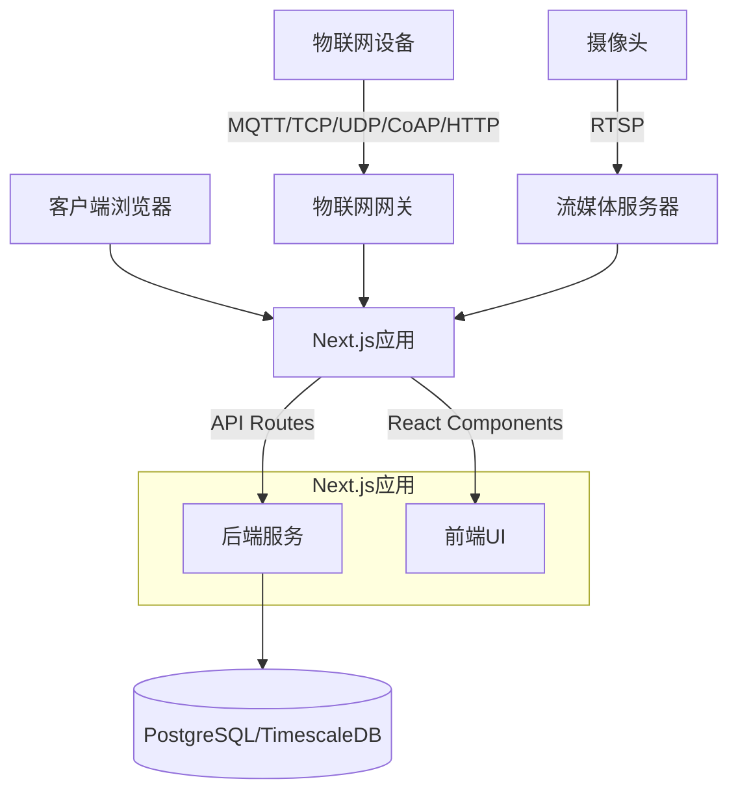
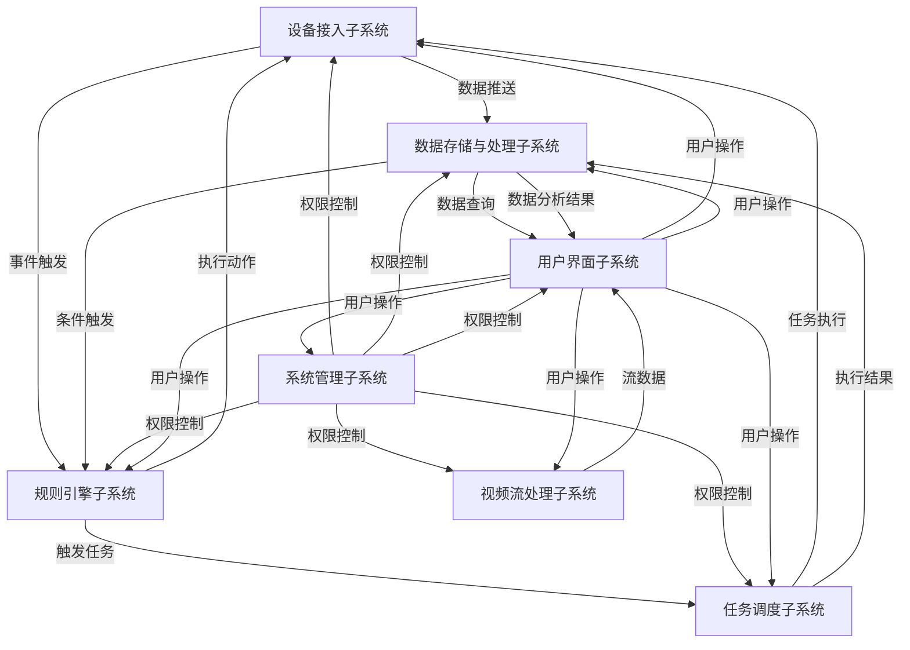
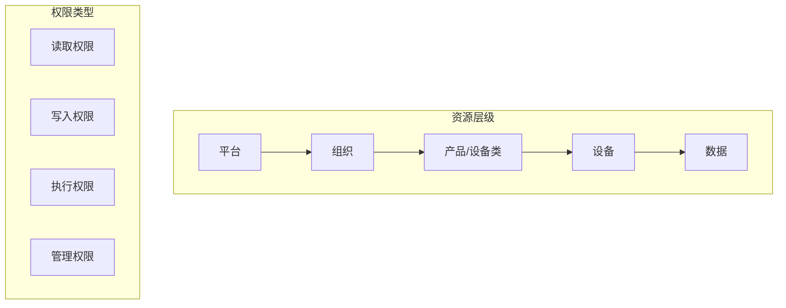

# 准望物联监测平台技术方案设计

## 技术栈

### 核心框架
- **Next.js**：基于React的全栈框架，支持服务端渲染(SSR)、静态站点生成(SSG)和API路由
  - 版本：14.x
  - 特性：App Router、Server Components、Server Actions
  - 优势：前后端一体化开发，减少代码分离带来的复杂性

### 前端技术
- **React**：用于构建用户界面的JavaScript库
  - 版本：18.x
  - 特性：Hooks、Concurrent Mode、Suspense
- **TypeScript**：JavaScript的超集，提供静态类型检查
  - 版本：5.x
  - 优势：提高代码质量和可维护性，增强IDE智能提示
- **TailwindCSS**：实用优先的CSS框架
  - 版本：3.x
  - 优势：高度可定制，避免CSS冗余，提高开发效率
- **Shadcn/UI**：基于Radix UI的组件库
  - 优势：可定制性强，无需安装依赖，直接复制代码到项目中
- **Zustand**：轻量级状态管理库
  - 优势：简单易用，支持TypeScript，适合中小型应用
- **React Query**：用于数据获取、缓存和状态管理
  - 优势：简化服务端状态管理，提供缓存和自动重新获取功能

### 后端技术
- **Next.js API Routes**：基于文件系统的API路由
  - 特性：支持动态路由、API中间件
- **Node.js**：JavaScript运行时环境
  - 版本：18.x LTS
- **Prisma**：现代数据库ORM
  - 优势：类型安全的数据库访问，自动生成类型定义
- **内置身份验证**：自定义身份验证系统
  - 优势：完全可控的身份验证流程

### 数据库
- **PostgreSQL**：开源关系型数据库
  - 版本：15.x
  - 优势：强大的SQL功能，支持JSON数据类型
- **TimescaleDB**：PostgreSQL的时序数据库扩展
  - 用途：存储物联网设备产生的时序数据
  - 优势：高效处理时间序列数据，支持自动分区，查询性能优化

### 物联网协议支持
- **MQTT**：轻量级物联网消息传输协议
  - 实现：MQTT.js、Mosquitto
- **TCP/UDP**：基础网络协议
  - 实现：Node.js net和dgram模块
- **CoAP**：受限应用协议，适用于资源受限设备
  - 实现：node-coap
- **HTTP/HTTPS**：标准Web协议
  - 实现：Node.js http/https模块、Axios

### 视频流处理
- **RTSP**：实时流协议
  - 实现：node-rtsp-stream

### 开发工具
- **ESLint**：JavaScript代码检查工具
- **Prettier**：代码格式化工具
- **Jest**：JavaScript测试框架
- **Cypress**：端到端测试框架

### 部署架构
- **服务器部署**：使用物理服务器或虚拟机
- **负载均衡**：Nginx或云服务提供商的负载均衡
- **CDN**：用于静态资源分发
- **监控**：Prometheus和Grafana

### 系统架构图

## 开发与部署流程

### 开发环境设置
1. Node.js和npm环境配置
2. 项目初始化与依赖安装
3. 数据库服务配置
4. 开发服务器启动与热重载

### 开发流程
1. 功能模块划分与任务分配
2. 组件开发与单元测试
3. API接口开发与集成测试
4. 端到端测试验证

### 部署流程
1. 代码提交与版本控制
2. 手动测试与构建
3. 服务器环境配置
4. 应用部署与配置
5. 监控与日志收集

### 性能优化策略
1. 服务端组件与客户端组件合理划分
2. 静态生成与增量静态再生成(ISR)应用
3. 图片优化与懒加载
4. API路由缓存策略
5. 数据库查询优化 

## 子系统功能与关系

### 子系统划分

#### 1. 设备接入子系统
- **功能职责**：负责物联网设备的接入、认证、数据接收和指令下发
- **核心组件**：
  - **协议适配器**：支持MQTT、TCP、UDP、CoAP和HTTP协议
  - **设备认证服务**：验证设备身份和权限
  - **数据接收处理器**：接收设备上报的数据并进行初步处理
  - **指令下发服务**：将平台指令下发到设备

#### 2. 视频流处理子系统
- **功能职责**：负责摄像头视频流的接入、转换和分发
- **核心组件**：
  - **流媒体服务器**：接收RTSP视频流
  - **视频转码服务**：将视频流转换为Web友好格式
  - **视频分发服务**：将视频流分发给前端展示

#### 3. 数据存储与处理子系统
- **功能职责**：负责设备数据的存储、处理和分析
- **核心组件**：
  - **TimescaleDB服务**：存储设备上报的时序数据
  - **数据处理服务**：数据清洗、转换和聚合
  - **数据分析服务**：数据统计分析和报表生成

#### 4. 规则引擎子系统
- **功能职责**：负责场景联动规则的执行和触发
- **核心组件**：
  - **规则解析器**：解析和验证规则定义
  - **规则执行引擎**：执行触发条件匹配和动作执行
  - **规则监控服务**：监控规则执行状态和结果

#### 5. 任务调度子系统
- **功能职责**：负责任务的创建、调度和执行
- **核心组件**：
  - **任务定义服务**：创建和管理任务定义
  - **调度器**：按照定时策略调度任务执行
  - **执行器**：执行任务并收集执行结果

#### 6. 用户界面子系统
- **功能职责**：负责用户交互界面的渲染和响应
- **核心组件**：
  - **页面渲染服务**：服务端和客户端渲染
  - **组件库**：UI组件和业务组件
  - **状态管理**：前端数据状态管理

#### 7. 系统管理子系统
- **功能职责**：负责平台配置、组织和权限管理
- **核心组件**：
  - **配置管理服务**：管理平台配置信息
  - **组织管理服务**：管理组织结构和层级
  - **权限控制服务**：管理用户权限和访问控制

### 系统间关联与推送关系

### 数据流向

1. **设备数据流**
   - 设备 → 设备接入子系统 → 数据存储与处理子系统 → 用户界面子系统
   - 设备 → 设备接入子系统 → 规则引擎子系统 → 任务调度子系统 → 设备接入子系统 → 设备

2. **视频数据流**
   - 摄像头 → 视频流处理子系统 → 用户界面子系统

3. **命令控制流**
   - 用户界面子系统 → 设备接入子系统 → 设备
   - 规则引擎子系统 → 设备接入子系统 → 设备
   - 任务调度子系统 → 设备接入子系统 → 设备

4. **配置管理流**
   - 用户界面子系统 → 系统管理子系统 → 各子系统

### 权限关系

#### 1. 用户角色定义

1. **系统管理员**
   - 权限范围：所有功能的完全访问权限
   - 特殊权限：平台定制、组织管理、用户管理

2. **组织管理员**
   - 权限范围：所属组织内的所有功能
   - 特殊权限：组织内用户管理、设备管理

3. **普通用户**
   - 权限范围：被授权的功能模块
   - 特殊权限：无

4. **设备用户**
   - 权限范围：特定设备的访问和控制
   - 特殊权限：无

#### 2. 资源访问控制

#### 3. 功能模块权限矩阵

| 功能模块 | 系统管理员 | 组织管理员 | 普通用户 | 设备用户 |
|---------|-----------|-----------|---------|---------|
| **可视化大屏** | 创建/编辑/查看 | 创建/编辑/查看(组织内) | 查看(被授权) | - |
| **设备类管理** | 创建/编辑/查看/删除 | 创建/编辑/查看/删除(组织内) | 查看(被授权) | - |
| **设备管理** | 创建/编辑/查看/删除/控制 | 创建/编辑/查看/删除/控制(组织内) | 查看/控制(被授权) | 查看/控制(特定设备) |
| **规则引擎** | 创建/编辑/查看/删除/启用 | 创建/编辑/查看/删除/启用(组织内) | 查看(被授权) | - |
| **任务中心** | 创建/编辑/查看/删除/执行 | 创建/编辑/查看/删除/执行(组织内) | 查看/执行(被授权) | - |
| **报表中心** | 创建/编辑/查看/删除/导出 | 创建/编辑/查看/删除/导出(组织内) | 查看/导出(被授权) | - |
| **视频中心** | 创建/编辑/查看/删除/控制 | 创建/编辑/查看/删除/控制(组织内) | 查看/控制(被授权) | 查看(特定摄像头) |
| **系统管理** | 完全控制 | 组织内控制 | - | - |

#### 4. 数据访问控制

1. **组织隔离**
   - 不同组织的数据默认相互隔离
   - 可通过"公开"属性设置跨组织访问

2. **数据权限控制**
   - 设备数据：按组织和用户权限控制访问
   - 系统配置数据：仅管理员访问

3. **API访问控制**
   - 基于JWT的身份验证
   - 基于角色的权限控制
   - API访问频率限制

## 设备接入

1. **直连设备**
   - 集成方式：MQTT / HTTP / CoAP
   - 数据流向：双向（设备→平台，平台→设备）

2. **网关设备**
   - 集成方式：MQTT / TCP / UDP
   - 数据流向：双向（子设备↔网关↔平台）

3. **视频设备**
   - 集成方式：RTSP
   - 数据流向：单向（摄像头→平台）

## 扩展性设计

### 系统扩展性

1. **模块化架构**
   - 各子系统采用模块化设计
   - 基于服务器的垂直扩展

2. **数据存储优化**
   - 使用TimescaleDB优化时序数据存储和查询
   - 支持数据自动归档和压缩