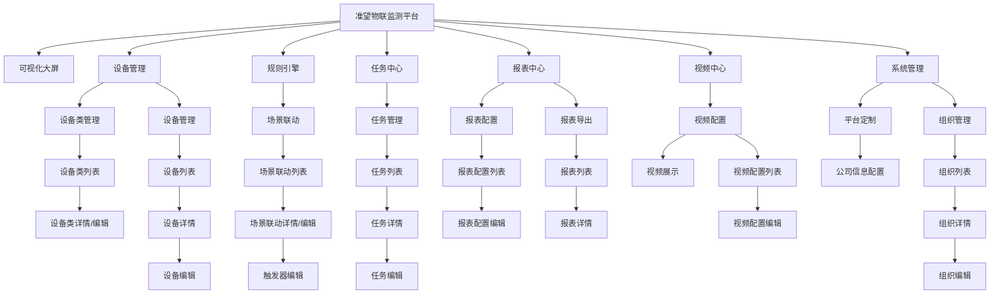

# 准望物联监测平台系统设计文档

## 系统概述
准望物联监测平台是基于nextjs框架的开箱即用物联网平台，用于实现物联网数据收集、分析处理、可视化和设备管理。平台支持通过行业标准物联网协议（MQTT、TCP、UDP、CoAP和HTTP）实现设备连接，通过使用ws://或http://的流媒体实现摄像头视频流接入，帮助用户屏蔽物联网的复杂特性，专注于业务应用开发，缩短物联网项目的交付周期。

## 系统功能结构

### 1. 可视化大屏
#### 1.1 大屏展示
- **功能描述**：用于配合显示其他版块内容的可视化界面
- **功能要点**：
  - 支持灵活布局，展示各类数据与内容
  - 与其他功能模块联动，实时展示系统数据

### 2. 设备管理
#### 2.1 设备类管理
- **功能描述**：提供设备连接模板的配置功能，支持对设备类型、通信协议、参数等进行标准化定义
- **功能要点**：
  - **设备类列表页**
    - 展示所有设备类信息（图片、产品名称、品类、设备类型、配置类型、接入协议、默认配置、描述、创建时间）
    - 支持按条件筛选和搜索设备类
    - 提供操作入口（查看详情、编辑、删除、设置默认值）
  - **设备类详情/编辑页**（从属于列表页）
    - 设备类图片上传与预览
    - 设备类产品名称设置
    - 设备类产品品类选择（系统预设/自定义）
    - 设备类型选择（直连设备/网关子设备）
    - 设备类配置类型设置（默认/自定义）
    - 设备类接入协议选择（MQTT/TCP/UDP/CoAP/HTTP）
    - 设备类默认配置设置
    - 设备类描述编辑
    - 保存/取消操作

#### 2.2 设备管理
- **功能描述**：用于查看、检索设备状态，查看上下线记录，设置重点关注
- **功能要点**：
  - **设备列表页**
    - 展示设备信息（状态、图片、别名/设备名称、设备类型、所属产品、所属组织、公开状态、最后连接时间、最后断开时间）
    - 支持按条件筛选和搜索设备
    - 提供操作入口（查看上下线记录、设置重点关注、查看详情、编辑）
  - **设备详情页**（从属于列表页）
    - 设备基本信息展示
    - 告警事项查看（告警状态、告警设备、告警场景、告警级别、告警详情、确认状态、告警时间）
    - 命令下发记录查看（命令下发时间、命令类型、响应类型、命令状态、响应内容、命令内容）
    - 事件管理查看（时间、标识符、事件名称、事件类型、输出参数）
    - 关联任务查看
  - **设备编辑页**（从属于详情页）
    - 设备基本信息编辑
    - 保存/取消操作

### 3. 规则引擎
#### 3.1 场景联动
- **功能描述**：通过配置触发条件、执行动作和执行条件，实现设备与设备之间、设备与应用之间的联动
- **功能要点**：
  - **场景联动列表页**
    - 展示场景联动信息（场景联动名称、触发方式、状态、描述、所属组织、公开状态、创建者、创建时间）
    - 支持按条件筛选和搜索场景联动
    - 提供操作入口（查看详情、编辑、新建触发器、编辑触发条件）
  - **场景联动详情/编辑页**（从属于列表页）
    - 场景联动名称设置
    - 触发方式选择（设备触发/属性触发）
    - 状态设置（启用/禁用）
    - 描述编辑
    - 所属组织选择
    - 公开状态设置
    - 保存/取消操作
  - **触发器编辑页**（从属于详情/编辑页）
    - 触发条件配置
    - 执行动作配置
    - 执行条件配置
    - 保存/取消操作

### 4. 任务中心
#### 4.1 任务管理
- **功能描述**：用于创建、查看和管理系统中的各类任务
- **功能要点**：
  - **任务列表页**
    - 展示任务信息（任务名称、目标类型、任务状态、任务类型、定时方式、执行参数、命令内容、所属组织、公开状态、创建时间、修改时间）
    - 支持按条件筛选和搜索任务
    - 提供操作入口（查看详情、编辑）
  - **任务详情页**（从属于列表页）
    - 任务详细信息展示
    - 任务执行记录查看
  - **任务编辑页**（从属于详情页）
    - 任务名称设置
    - 目标类型选择（设备/网关/网关下属设备）
    - 任务状态设置（启用/停用）
    - 任务类型选择（自定义数据下发/属性设置）
    - 定时方式选择（单次执行/间隔时间重复/指定时间执行/Cron表达式）
    - 执行参数配置
    - 命令内容编辑
    - 所属组织选择
    - 公开状态设置
    - 保存/取消操作

### 5. 报表中心
#### 5.1 报表配置
- **功能描述**：用于创建和管理数据报表的配置信息
- **功能要点**：
  - **报表配置列表页**
    - 展示报表配置信息（配置名称、所属组织、数据类型、配置状态、执行方式、执行设备、创建人、创建时间）
    - 支持按条件筛选和搜索报表配置
    - 提供批量下载功能
    - 提供操作入口（编辑）
  - **报表配置编辑页**（从属于列表页）
    - 报表名称设置
    - 所属组织选择
    - 描述编辑
    - 执行方式设置（立即执行/定时执行）
    - 执行时间配置
    - 执行设备选择（多选）
    - 数据类型选择
    - 聚合条件设置
    - 最大条数限制
    - 保存/取消操作

#### 5.2 报表导出
- **功能描述**：用于查看、展示、导出按报表配置生成的报表
- **功能要点**：
  - **报表列表页**
    - 展示报表信息（配置名称、组织、数据类型、执行方式、执行状态、执行日期）
    - 支持按条件筛选和搜索报表
    - 提供批量下载功能
    - 提供操作入口（查看详情、下载报表）
  - **报表详情页**（从属于列表页）
    - 报表数据展示
    - 导出功能

### 6. 视频中心
#### 6.1 视频配置
- **功能描述**：用于配置和管理使用ws://或http://的流媒体视频流
- **功能要点**：
  - **视频展示页**
    - 分屏模式切换（单屏幕/四宫格/九宫格）
    - 视频流实时展示
  - **视频配置列表页**
    - 展示视频配置信息（视频封面、视频名字、摄像头编号/监控点编号、视频流、所属组织、视频流获取方式、创建时间）
    - 支持按条件筛选和搜索视频配置
    - 提供操作入口（查看视频预览、编辑配置、删除、启用/停用）
  - **视频配置编辑页**（从属于列表页）
    - 视频名称设置
    - 摄像头编号/监控点编号设置
    - 视频流地址配置
    - 所属组织选择
    - 视频流获取方式选择
    - 保存/取消操作

### 7. 系统管理
#### 7.1 平台定制
- **功能描述**：用于配置系统的品牌标识和外观
- **功能要点**：
  - **公司信息配置页**
    - 公司名称设置
    - 公司简称设置
    - 公司官网设置
    - 公司邮箱设置
    - 公司简介编辑
    - 国家/地区选择
    - 所在城市设置
    - 详细地址设置
    - 联系人设置
    - 联系电话设置
    - 联系我们信息设置
    - 保存/取消操作

#### 7.2 组织管理
- **功能描述**：用于创建和管理系统中的组织架构
- **功能要点**：
  - **组织列表页**
    - 展示组织信息（组织名称、级别、上级组织、组织编码、创建时间、备注）
    - 支持按条件筛选和搜索组织
    - 提供操作入口（查看详情、编辑、删除、添加子组织）
  - **组织详情页**（从属于列表页）
    - 组织详细信息展示
    - 下属组织展示
  - **组织编辑页**（从属于详情页）
    - 组织名称设置
    - 级别设置
    - 上级组织选择
    - 组织编码设置
    - 备注编辑
    - 保存/取消操作

## 功能关系图

## 数据流关系

### 设备数据流
1. 设备通过MQTT、TCP、UDP、CoAP或HTTP协议连接到平台
2. 设备数据上报到平台后，存储到数据库
3. 数据可被用于：
   - 实时展示在可视化大屏
   - 触发规则引擎中的场景联动
   - 生成报表中心的数据报表
   - 作为任务中心的任务执行依据

### 视频数据流
1. 摄像头通过使用ws://或http://的流媒体协议接入平台
2. 视频流数据实时展示在视频中心

### 命令控制流
1. 用户通过平台界面下发命令
2. 命令通过平台传递给目标设备
3. 设备执行命令并返回结果
4. 结果记录在设备管理的命令下发记录中

### 告警事件流
1. 设备上报异常数据或规则引擎检测到异常情况
2. 系统生成告警事件
3. 告警事件记录在设备管理的告警事项中
4. 可触发规则引擎中的场景联动

## 页面层级关系
- 一级页面：系统主要功能模块入口
- 二级页面：各功能模块的列表页面
- 三级页面：从列表页面进入的详情页面
- 四级页面：从详情页面进入的编辑页面或更深层次的功能页面

每个页面都有明确的导航路径，确保用户能够清晰了解当前位置并方便返回上级页面。 