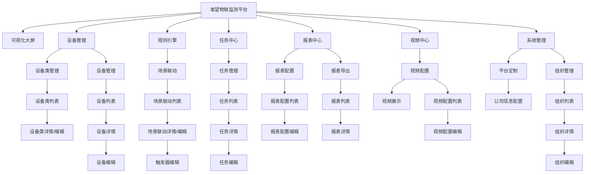
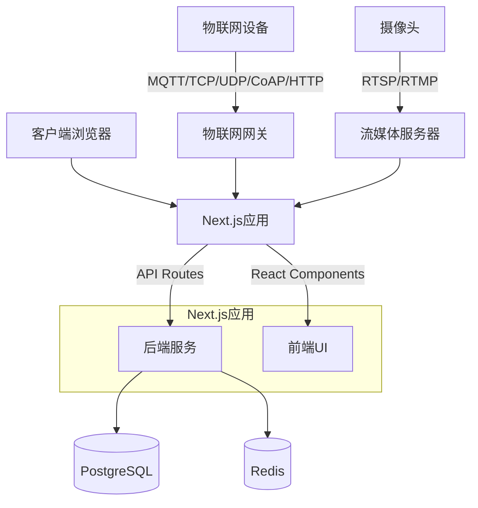
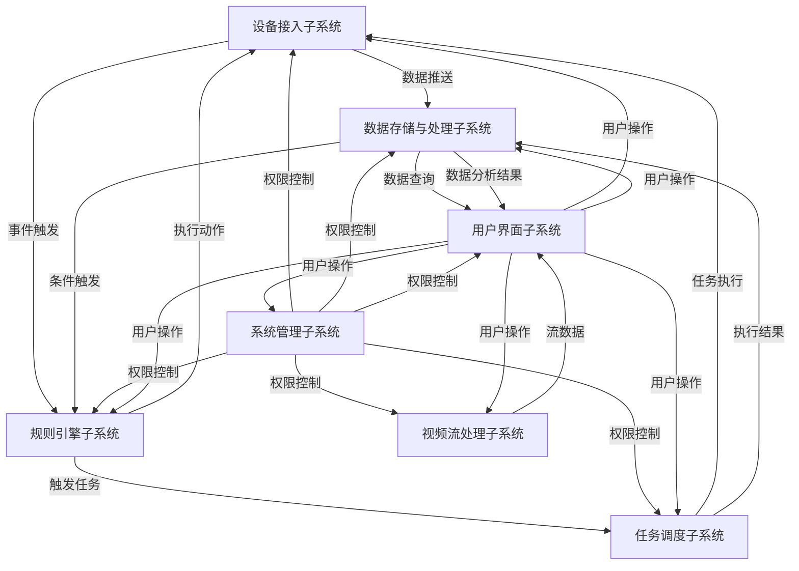
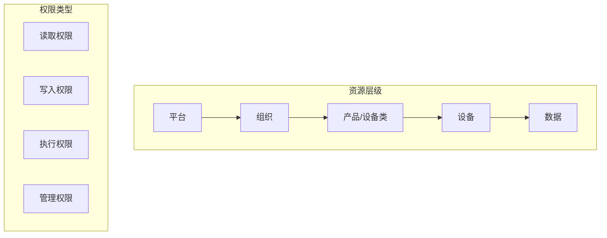

# 准望物联监测平台系统设计文档

## 系统概述
准望物联监测平台是基于nextjs框架的开箱即用物联网平台，用于实现物联网数据收集、分析处理、可视化和设备管理。平台支持通过行业标准物联网协议（MQTT、TCP、UDP、CoAP和HTTP）实现设备连接，通过rtsp、rtmp实现摄像头视频流接入，帮助用户屏蔽物联网的复杂特性，专注于业务应用开发，缩短物联网项目的交付周期。

## 系统功能结构

### 1. 可视化大屏
#### 1.1 大屏展示
- **功能描述**：用于配合显示其他版块内容的可视化界面
- **功能要点**：
  - 支持灵活布局，展示各类数据与内容
  - 与其他功能模块联动，实时展示系统数据

### 2. 设备管理
#### 2.1 设备类管理
- **功能描述**：提供设备连接模板的配置功能，支持对设备类型、通信协议、参数等进行标准化定义
- **功能要点**：
  - **设备类列表页**
    - 展示所有设备类信息（图片、产品名称、品类、设备类型、配置类型、接入协议、默认配置、描述、创建时间）
    - 支持按条件筛选和搜索设备类
    - 提供操作入口（查看详情、编辑、删除、设置默认值）
  - **设备类详情/编辑页**（从属于列表页）
    - 设备类图片上传与预览
    - 设备类产品名称设置
    - 设备类产品品类选择（系统预设/自定义）
    - 设备类型选择（直连设备/网关子设备）
    - 设备类配置类型设置（默认/自定义）
    - 设备类接入协议选择（MQTT/TCP/UDP/CoAP/HTTP）
    - 设备类默认配置设置
    - 设备类描述编辑
    - 保存/取消操作

#### 2.2 设备管理
- **功能描述**：用于查看、检索设备状态，查看上下线记录，设置重点关注
- **功能要点**：
  - **设备列表页**
    - 展示设备信息（状态、图片、别名/设备名称、设备类型、所属产品、所属组织、公开状态、最后连接时间、最后断开时间）
    - 支持按条件筛选和搜索设备
    - 提供操作入口（查看上下线记录、设置重点关注、查看详情、编辑）
  - **设备详情页**（从属于列表页）
    - 设备基本信息展示
    - 告警事项查看（告警状态、告警设备、告警场景、告警级别、告警详情、确认状态、告警时间）
    - 命令下发记录查看（命令下发时间、命令类型、响应类型、命令状态、响应内容、命令内容）
    - 事件管理查看（时间、标识符、事件名称、事件类型、输出参数）
    - 关联任务查看
  - **设备编辑页**（从属于详情页）
    - 设备基本信息编辑
    - 保存/取消操作

### 3. 规则引擎
#### 3.1 场景联动
- **功能描述**：通过配置触发条件、执行动作和执行条件，实现设备与设备之间、设备与应用之间的联动
- **功能要点**：
  - **场景联动列表页**
    - 展示场景联动信息（场景联动名称、触发方式、状态、描述、所属组织、公开状态、创建者、创建时间）
    - 支持按条件筛选和搜索场景联动
    - 提供操作入口（查看详情、编辑、新建触发器、编辑触发条件）
  - **场景联动详情/编辑页**（从属于列表页）
    - 场景联动名称设置
    - 触发方式选择（设备触发/属性触发）
    - 状态设置（启用/禁用）
    - 描述编辑
    - 所属组织选择
    - 公开状态设置
    - 保存/取消操作
  - **触发器编辑页**（从属于详情/编辑页）
    - 触发条件配置
    - 执行动作配置
    - 执行条件配置
    - 保存/取消操作

### 4. 任务中心
#### 4.1 任务管理
- **功能描述**：用于创建、查看和管理系统中的各类任务
- **功能要点**：
  - **任务列表页**
    - 展示任务信息（任务名称、目标类型、任务状态、任务类型、定时方式、执行参数、命令内容、所属组织、公开状态、创建时间、修改时间）
    - 支持按条件筛选和搜索任务
    - 提供操作入口（查看详情、编辑）
  - **任务详情页**（从属于列表页）
    - 任务详细信息展示
    - 任务执行记录查看
  - **任务编辑页**（从属于详情页）
    - 任务名称设置
    - 目标类型选择（设备/网关/网关下属设备）
    - 任务状态设置（启用/停用）
    - 任务类型选择（自定义数据下发/属性设置）
    - 定时方式选择（单次执行/间隔时间重复/指定时间执行/Cron表达式）
    - 执行参数配置
    - 命令内容编辑
    - 所属组织选择
    - 公开状态设置
    - 保存/取消操作

### 5. 报表中心
#### 5.1 报表配置
- **功能描述**：用于创建和管理数据报表的配置信息
- **功能要点**：
  - **报表配置列表页**
    - 展示报表配置信息（配置名称、所属组织、数据类型、配置状态、执行方式、执行设备、创建人、创建时间）
    - 支持按条件筛选和搜索报表配置
    - 提供批量下载功能
    - 提供操作入口（编辑）
  - **报表配置编辑页**（从属于列表页）
    - 报表名称设置
    - 所属组织选择
    - 描述编辑
    - 执行方式设置（立即执行/定时执行）
    - 执行时间配置
    - 执行设备选择（多选）
    - 数据类型选择
    - 聚合条件设置
    - 最大条数限制
    - 保存/取消操作

#### 5.2 报表导出
- **功能描述**：用于查看、展示、导出按报表配置生成的报表
- **功能要点**：
  - **报表列表页**
    - 展示报表信息（配置名称、组织、数据类型、执行方式、执行状态、执行日期）
    - 支持按条件筛选和搜索报表
    - 提供批量下载功能
    - 提供操作入口（查看详情、下载报表）
  - **报表详情页**（从属于列表页）
    - 报表数据展示
    - 导出功能

### 6. 视频中心
#### 6.1 视频配置
- **功能描述**：用于配置和管理rtsp视频流
- **功能要点**：
  - **视频展示页**
    - 分屏模式切换（单屏幕/四宫格/九宫格）
    - 视频流实时展示
  - **视频配置列表页**
    - 展示视频配置信息（视频封面、视频名字、摄像头编号/监控点编号、视频流、所属组织、视频流获取方式、创建时间）
    - 支持按条件筛选和搜索视频配置
    - 提供操作入口（查看视频预览、编辑配置、删除、启用/停用）
  - **视频配置编辑页**（从属于列表页）
    - 视频名称设置
    - 摄像头编号/监控点编号设置
    - 视频流地址配置
    - 所属组织选择
    - 视频流获取方式选择
    - 保存/取消操作

### 7. 系统管理
#### 7.1 平台定制
- **功能描述**：用于配置系统的品牌标识和外观
- **功能要点**：
  - **公司信息配置页**
    - 公司名称设置
    - 公司简称设置
    - 公司官网设置
    - 公司邮箱设置
    - 公司简介编辑
    - 国家/地区选择
    - 所在城市设置
    - 详细地址设置
    - 联系人设置
    - 联系电话设置
    - 联系我们信息设置
    - 保存/取消操作

#### 7.2 组织管理
- **功能描述**：用于创建和管理系统中的组织架构
- **功能要点**：
  - **组织列表页**
    - 展示组织信息（组织名称、级别、上级组织、组织编码、创建时间、备注）
    - 支持按条件筛选和搜索组织
    - 提供操作入口（查看详情、编辑、删除、添加子组织）
  - **组织详情页**（从属于列表页）
    - 组织详细信息展示
    - 下属组织展示
  - **组织编辑页**（从属于详情页）
    - 组织名称设置
    - 级别设置
    - 上级组织选择
    - 组织编码设置
    - 备注编辑
    - 保存/取消操作

## 功能关系图

## 数据流关系

### 设备数据流
1. 设备通过MQTT、TCP、UDP、CoAP或HTTP协议连接到平台
2. 设备数据上报到平台后，存储到数据库
3. 数据可被用于：
   - 实时展示在可视化大屏
   - 触发规则引擎中的场景联动
   - 生成报表中心的数据报表
   - 作为任务中心的任务执行依据

### 视频数据流
1. 摄像头通过RTSP/RTMP协议接入平台
2. 视频流数据实时展示在视频中心

### 命令控制流
1. 用户通过平台界面下发命令
2. 命令通过平台传递给目标设备
3. 设备执行命令并返回结果
4. 结果记录在设备管理的命令下发记录中

### 告警事件流
1. 设备上报异常数据或规则引擎检测到异常情况
2. 系统生成告警事件
3. 告警事件记录在设备管理的告警事项中
4. 可触发规则引擎中的场景联动

## 页面层级关系
- 一级页面：系统主要功能模块入口
- 二级页面：各功能模块的列表页面
- 三级页面：从列表页面进入的详情页面
- 四级页面：从详情页面进入的编辑页面或更深层次的功能页面

每个页面都有明确的导航路径，确保用户能够清晰了解当前位置并方便返回上级页面。 

## 技术栈

### 核心框架
- **Next.js**：基于React的全栈框架，支持服务端渲染(SSR)、静态站点生成(SSG)和API路由
  - 版本：14.x
  - 特性：App Router、Server Components、Server Actions
  - 优势：前后端一体化开发，减少代码分离带来的复杂性

### 前端技术
- **React**：用于构建用户界面的JavaScript库
  - 版本：18.x
  - 特性：Hooks、Concurrent Mode、Suspense
- **TypeScript**：JavaScript的超集，提供静态类型检查
  - 版本：5.x
  - 优势：提高代码质量和可维护性，增强IDE智能提示
- **TailwindCSS**：实用优先的CSS框架
  - 版本：3.x
  - 优势：高度可定制，避免CSS冗余，提高开发效率
- **Shadcn/UI**：基于Radix UI的组件库
  - 优势：可定制性强，无需安装依赖，直接复制代码到项目中
- **Zustand**：轻量级状态管理库
  - 优势：简单易用，支持TypeScript，适合中小型应用
- **React Query**：用于数据获取、缓存和状态管理
  - 优势：简化服务端状态管理，提供缓存和自动重新获取功能

### 后端技术
- **Next.js API Routes**：基于文件系统的API路由
  - 特性：支持动态路由、API中间件
- **Node.js**：JavaScript运行时环境
  - 版本：18.x LTS
- **Prisma**：现代数据库ORM
  - 优势：类型安全的数据库访问，自动生成类型定义
- **NextAuth.js**：身份验证解决方案
  - 优势：支持多种认证提供商，易于集成

### 数据库
- **PostgreSQL**：开源关系型数据库
  - 版本：15.x
  - 优势：强大的SQL功能，支持JSON数据类型
- **Redis**：内存数据结构存储
  - 用途：缓存、会话存储、实时数据处理

### 物联网协议支持
- **MQTT**：轻量级物联网消息传输协议
  - 实现：MQTT.js、Mosquitto
- **TCP/UDP**：基础网络协议
  - 实现：Node.js net和dgram模块
- **CoAP**：受限应用协议，适用于资源受限设备
  - 实现：node-coap
- **HTTP/HTTPS**：标准Web协议
  - 实现：Node.js http/https模块、Axios

### 视频流处理
- **RTSP/RTMP**：实时流协议
  - 实现：node-rtsp-stream、node-media-server
- **WebRTC**：用于浏览器实时通信
  - 用途：低延迟视频流展示

### 开发工具
- **ESLint**：JavaScript代码检查工具
- **Prettier**：代码格式化工具
- **Jest**：JavaScript测试框架
- **Cypress**：端到端测试框架
- **Docker**：容器化部署
- **GitHub Actions**：CI/CD自动化工作流

### 部署架构
- **容器化部署**：使用Docker和Docker Compose
- **负载均衡**：Nginx或云服务提供商的负载均衡
- **CDN**：用于静态资源分发
- **监控**：Prometheus和Grafana

### 系统架构图

## 开发与部署流程

### 开发环境设置
1. Node.js和npm环境配置
2. 项目初始化与依赖安装
3. 数据库和Redis服务配置
4. 开发服务器启动与热重载

### 开发流程
1. 功能模块划分与任务分配
2. 组件开发与单元测试
3. API接口开发与集成测试
4. 端到端测试验证

### 部署流程
1. 代码提交触发CI/CD流程
2. 自动化测试与构建
3. Docker镜像构建与推送
4. 容器编排与服务部署
5. 监控与日志收集

### 性能优化策略
1. 服务端组件与客户端组件合理划分
2. 静态生成与增量静态再生成(ISR)应用
3. 图片优化与懒加载
4. API路由缓存策略
5. 数据库查询优化 

## 子系统功能与关系

### 子系统划分

#### 1. 设备接入子系统
- **功能职责**：负责物联网设备的接入、认证、数据接收和指令下发
- **核心组件**：
  - **协议适配器**：支持MQTT、TCP、UDP、CoAP和HTTP协议
  - **设备认证服务**：验证设备身份和权限
  - **数据接收处理器**：接收设备上报的数据并进行初步处理
  - **指令下发服务**：将平台指令下发到设备

#### 2. 视频流处理子系统
- **功能职责**：负责摄像头视频流的接入、转换和分发
- **核心组件**：
  - **流媒体服务器**：接收RTSP/RTMP视频流
  - **视频转码服务**：将视频流转换为Web友好格式
  - **视频分发服务**：将视频流分发给前端展示

#### 3. 数据存储与处理子系统
- **功能职责**：负责设备数据的存储、处理和分析
- **核心组件**：
  - **时序数据库服务**：存储设备上报的时序数据
  - **数据处理服务**：数据清洗、转换和聚合
  - **数据分析服务**：数据统计分析和报表生成

#### 4. 规则引擎子系统
- **功能职责**：负责场景联动规则的执行和触发
- **核心组件**：
  - **规则解析器**：解析和验证规则定义
  - **规则执行引擎**：执行触发条件匹配和动作执行
  - **规则监控服务**：监控规则执行状态和结果

#### 5. 任务调度子系统
- **功能职责**：负责任务的创建、调度和执行
- **核心组件**：
  - **任务定义服务**：创建和管理任务定义
  - **调度器**：按照定时策略调度任务执行
  - **执行器**：执行任务并收集执行结果

#### 6. 用户界面子系统
- **功能职责**：负责用户交互界面的渲染和响应
- **核心组件**：
  - **页面渲染服务**：服务端和客户端渲染
  - **组件库**：UI组件和业务组件
  - **状态管理**：前端数据状态管理

#### 7. 系统管理子系统
- **功能职责**：负责平台配置、组织和权限管理
- **核心组件**：
  - **配置管理服务**：管理平台配置信息
  - **组织管理服务**：管理组织结构和层级
  - **权限控制服务**：管理用户权限和访问控制

### 系统间关联与推送关系

### 数据流向

1. **设备数据流**
   - 设备 → 设备接入子系统 → 数据存储与处理子系统 → 用户界面子系统
   - 设备 → 设备接入子系统 → 规则引擎子系统 → 任务调度子系统 → 设备接入子系统 → 设备

2. **视频数据流**
   - 摄像头 → 视频流处理子系统 → 用户界面子系统

3. **命令控制流**
   - 用户界面子系统 → 设备接入子系统 → 设备
   - 规则引擎子系统 → 设备接入子系统 → 设备
   - 任务调度子系统 → 设备接入子系统 → 设备

4. **配置管理流**
   - 用户界面子系统 → 系统管理子系统 → 各子系统

### 权限关系

#### 1. 用户角色定义

1. **系统管理员**
   - 权限范围：所有功能的完全访问权限
   - 特殊权限：平台定制、组织管理、用户管理

2. **组织管理员**
   - 权限范围：所属组织内的所有功能
   - 特殊权限：组织内用户管理、设备管理

3. **普通用户**
   - 权限范围：被授权的功能模块
   - 特殊权限：无

4. **设备用户**
   - 权限范围：特定设备的访问和控制
   - 特殊权限：无

#### 2. 资源访问控制

#### 3. 功能模块权限矩阵

| 功能模块 | 系统管理员 | 组织管理员 | 普通用户 | 设备用户 |
|---------|-----------|-----------|---------|---------|
| **可视化大屏** | 创建/编辑/查看 | 创建/编辑/查看(组织内) | 查看(被授权) | - |
| **设备类管理** | 创建/编辑/查看/删除 | 创建/编辑/查看/删除(组织内) | 查看(被授权) | - |
| **设备管理** | 创建/编辑/查看/删除/控制 | 创建/编辑/查看/删除/控制(组织内) | 查看/控制(被授权) | 查看/控制(特定设备) |
| **规则引擎** | 创建/编辑/查看/删除/启用 | 创建/编辑/查看/删除/启用(组织内) | 查看(被授权) | - |
| **任务中心** | 创建/编辑/查看/删除/执行 | 创建/编辑/查看/删除/执行(组织内) | 查看/执行(被授权) | - |
| **报表中心** | 创建/编辑/查看/删除/导出 | 创建/编辑/查看/删除/导出(组织内) | 查看/导出(被授权) | - |
| **视频中心** | 创建/编辑/查看/删除/控制 | 创建/编辑/查看/删除/控制(组织内) | 查看/控制(被授权) | 查看(特定摄像头) |
| **系统管理** | 完全控制 | 组织内控制 | - | - |

#### 4. 数据访问控制

1. **组织隔离**
   - 不同组织的数据默认相互隔离
   - 可通过"公开"属性设置跨组织访问

2. **数据分级**
   - 设备原始数据：组织内访问
   - 聚合数据：可配置访问权限
   - 系统配置数据：仅管理员访问

3. **API访问控制**
   - 基于JWT的身份验证
   - 基于角色的权限控制
   - API访问频率限制

## 系统集成点

### 外部系统集成

1. **第三方认证系统**
   - 集成方式：OAuth 2.0 / OIDC
   - 数据流向：用户认证信息

2. **企业内部系统**
   - 集成方式：REST API / 消息队列
   - 数据流向：设备数据、告警信息、报表数据

3. **云平台服务**
   - 集成方式：云服务API
   - 数据流向：数据存储、分析结果

### 设备集成

1. **直连设备**
   - 集成方式：MQTT / HTTP / CoAP
   - 数据流向：双向（设备→平台，平台→设备）

2. **网关设备**
   - 集成方式：MQTT / TCP / UDP
   - 数据流向：双向（子设备↔网关↔平台）

3. **视频设备**
   - 集成方式：RTSP / RTMP
   - 数据流向：单向（摄像头→平台）

## 扩展性设计

### 水平扩展

1. **微服务架构**
   - 各子系统可独立部署和扩展
   - 基于Docker容器的弹性伸缩

2. **数据分片**
   - 按组织/时间/设备类型进行数据分片
   - 支持分布式数据存储

### 垂直扩展

1. **插件系统**
   - 支持通过插件扩展系统功能
   - 预留自定义数据处理接口

2. **自定义开发**
   - 提供API和SDK供二次开发
   - 支持自定义UI组件和业务逻辑 