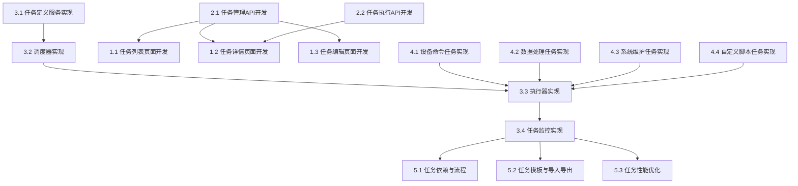

# 任务中心模块任务分解

## 任务分解原则
- 任务原则：能够指导cursor进行代码生成
- 分解粒度：细粒度（具体实现）
- 依赖关系：是
- 优先级：是（P0关键、P1重要、P2可选）
- 估算时间：是（小时/天）

## 功能概述
任务中心模块负责系统中各类任务的创建、调度和执行，包括定时任务、周期性任务和条件触发任务。该模块支持向设备下发命令、执行数据处理和触发系统操作等功能，是平台自动化运维的重要组成部分。

## 任务分解

### 1. 任务管理界面 [P0] [3天]
#### 1.1 任务列表页面开发
- **功能描述**：开发任务列表页面，展示任务信息
- **技术实现**：
  - 创建任务列表页面组件
  - 实现筛选、搜索和排序功能
  - 开发分页加载
  - 实现操作入口（查看详情、编辑）
- **验收标准**：
  - 能够展示任务信息
  - 支持按条件筛选和搜索任务
  - 分页功能正常，加载性能良好
  - 操作入口清晰，交互友好

#### 1.2 任务详情页面开发
- **功能描述**：开发任务详情页面，展示任务详细信息和执行记录
- **技术实现**：
  - 创建任务详情页面组件
  - 实现任务信息展示
  - 开发执行记录列表
  - 实现执行结果查看功能
- **验收标准**：
  - 能够展示任务详细信息
  - 执行记录列表完整
  - 执行结果查看功能正常
  - 页面布局合理，信息清晰

#### 1.3 任务编辑页面开发
- **功能描述**：开发任务编辑页面，支持任务信息的编辑和配置
- **技术实现**：
  - 创建任务编辑页面组件
  - 实现表单验证和提交
  - 开发定时方式配置组件
  - 实现命令内容编辑器组件
- **验收标准**：
  - 能够编辑任务基本信息和配置
  - 表单验证有效，提交成功后有反馈
  - 定时方式配置功能完整
  - 命令内容编辑器功能正常

### 2. 任务API接口 [P0] [2天]
#### 2.1 任务管理API开发
- **功能描述**：开发任务管理相关的API接口
- **技术实现**：
  - 创建任务CRUD API路由
  - 实现数据验证和错误处理
  - 开发任务状态管理API
  - 实现任务批量操作API
- **验收标准**：
  - API接口符合RESTful规范
  - 数据验证严格，错误处理完善
  - 状态管理API功能正常
  - 批量操作API高效可靠

#### 2.2 任务执行API开发
- **功能描述**：开发任务执行相关的API接口
- **技术实现**：
  - 创建任务立即执行API
  - 实现执行记录查询API
  - 开发执行结果获取API
  - 实现执行取消和暂停API
- **验收标准**：
  - 立即执行API功能正常
  - 执行记录查询API性能良好
  - 执行结果获取API准确
  - 执行控制API可靠

### 3. 任务调度系统 [P0] [4天]
#### 3.1 任务定义服务实现
- **功能描述**：实现任务定义服务，用于创建和管理任务定义
- **技术实现**：
  - 开发任务模型和验证逻辑
  - 实现任务参数处理
  - 开发任务依赖管理
  - 实现任务版本控制
- **验收标准**：
  - 任务模型设计合理
  - 参数处理准确无误
  - 依赖管理功能有效
  - 版本控制功能完整

#### 3.2 调度器实现
- **功能描述**：实现任务调度器，按照定时策略调度任务执行
- **技术实现**：
  - 开发定时调度算法
  - 实现Cron表达式解析
  - 开发任务队列管理
  - 实现分布式锁机制
- **验收标准**：
  - 定时调度准确可靠
  - Cron表达式解析正确
  - 任务队列管理高效
  - 分布式锁机制有效

#### 3.3 执行器实现
- **功能描述**：实现任务执行器，执行任务并收集执行结果
- **技术实现**：
  - 开发任务执行环境
  - 实现命令执行逻辑
  - 开发结果收集和处理
  - 实现错误处理和重试机制
- **验收标准**：
  - 执行环境稳定可靠
  - 命令执行成功率高
  - 结果收集完整准确
  - 错误处理和重试机制有效

#### 3.4 任务监控实现
- **功能描述**：实现任务监控功能，监控任务执行状态和性能
- **技术实现**：
  - 开发执行状态跟踪
  - 实现性能指标收集
  - 开发异常检测和告警
  - 实现统计报表生成
- **验收标准**：
  - 执行状态跟踪准确
  - 性能指标收集完整
  - 异常检测灵敏有效
  - 统计报表有用

### 4. 任务类型实现 [P1] [3天]
#### 4.1 设备命令任务实现
- **功能描述**：实现设备命令下发任务类型
- **技术实现**：
  - 开发命令格式化逻辑
  - 实现多协议命令下发
  - 开发响应处理逻辑
  - 实现批量命令优化
- **验收标准**：
  - 命令格式化正确
  - 多协议下发成功
  - 响应处理准确
  - 批量命令执行高效

#### 4.2 数据处理任务实现
- **功能描述**：实现数据处理任务类型
- **技术实现**：
  - 开发数据查询逻辑
  - 实现数据转换和计算
  - 开发结果存储逻辑
  - 实现数据导出功能
- **验收标准**：
  - 数据查询准确
  - 转换和计算正确
  - 结果存储完整
  - 数据导出功能正常

#### 4.3 系统维护任务实现
- **功能描述**：实现系统维护任务类型
- **技术实现**：
  - 开发数据清理逻辑
  - 实现备份任务
  - 开发系统检查逻辑
  - 实现资源优化功能
- **验收标准**：
  - 数据清理安全有效
  - 备份任务可靠
  - 系统检查全面
  - 资源优化有效

#### 4.4 自定义脚本任务实现
- **功能描述**：实现自定义脚本任务类型
- **技术实现**：
  - 开发脚本执行环境
  - 实现脚本参数传递
  - 开发结果捕获逻辑
  - 实现安全沙箱机制
- **验收标准**：
  - 脚本执行环境稳定
  - 参数传递正确
  - 结果捕获完整
  - 安全沙箱有效

### 5. 任务中心高级功能 [P2] [2天]
#### 5.1 任务依赖与流程
- **功能描述**：实现任务依赖和工作流功能
- **技术实现**：
  - 开发任务依赖定义
  - 实现工作流执行引擎
  - 开发条件分支逻辑
  - 实现并行任务处理
- **验收标准**：
  - 依赖定义清晰有效
  - 工作流执行正确
  - 条件分支逻辑准确
  - 并行任务处理高效

#### 5.2 任务模板与导入导出
- **功能描述**：实现任务模板和任务导入导出功能
- **技术实现**：
  - 开发任务模板管理
  - 实现任务导出功能
  - 开发任务导入功能
  - 实现模板参数化
- **验收标准**：
  - 模板管理功能完整
  - 任务导出格式标准
  - 任务导入验证严格
  - 模板参数化灵活

#### 5.3 任务性能优化
- **功能描述**：实现任务执行性能优化功能
- **技术实现**：
  - 开发任务负载均衡
  - 实现任务优先级管理
  - 开发资源限制机制
  - 实现执行计划优化
- **验收标准**：
  - 负载均衡有效
  - 优先级管理正确
  - 资源限制合理
  - 执行计划优化有效

## 依赖关系图
