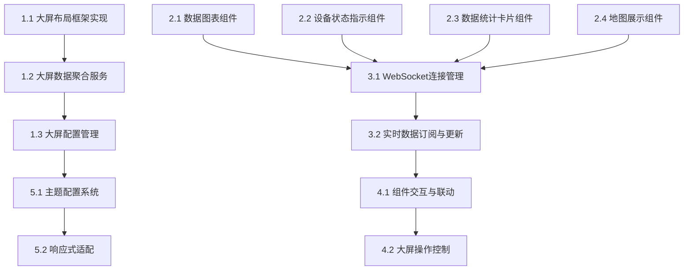

# 可视化大屏模块任务分解

## 任务分解原则
- 任务原则：能够指导cursor进行代码生成
- 分解粒度：细粒度（具体实现）
- 依赖关系：是
- 优先级：是（P0关键、P1重要、P2可选）
- 估算时间：是（小时/天）

## 功能概述
可视化大屏模块负责整体布局和数据聚合，提供各类可视化组件用于展示设备状态、数据统计和地图信息等。该模块是用户了解系统整体运行状况的主要入口。

## 任务分解

### 1. 大屏容器组件开发 [P0] [2天]
#### 1.1 大屏布局框架实现
- **功能描述**：创建响应式布局框架，支持不同尺寸屏幕和组件拖拽定位
- **技术实现**：
  - 使用TailwindCSS创建网格布局系统
  - 实现自适应布局，支持不同屏幕尺寸
  - 开发组件容器，支持组件拖拽和调整大小
- **验收标准**：
  - 布局框架能够适应不同屏幕尺寸
  - 支持组件拖拽定位和大小调整
  - 布局配置可保存和恢复

#### 1.2 大屏数据聚合服务
- **功能描述**：开发大屏数据聚合服务，从各数据源获取并整合数据
- **技术实现**：
  - 创建数据聚合API路由`/api/dashboard/data`
  - 实现数据源配置和数据获取逻辑
  - 使用React Query进行数据获取和缓存
- **验收标准**：
  - 能够从多个数据源获取数据
  - 数据更新及时，支持定时刷新
  - 数据格式规范，便于组件使用

#### 1.3 大屏配置管理
- **功能描述**：实现大屏配置的保存、加载和管理功能
- **技术实现**：
  - 创建大屏配置模型和API
  - 实现配置的CRUD操作
  - 开发配置界面组件
- **验收标准**：
  - 用户可以保存和加载大屏配置
  - 支持多个大屏配置切换
  - 配置更改实时生效

### 2. 可视化组件库开发 [P0] [3天]
#### 2.1 数据图表组件
- **功能描述**：开发各类数据图表组件，包括折线图、柱状图、饼图等
- **技术实现**：
  - 使用React组件封装图表库
  - 实现数据绑定和动态更新
  - 支持图表样式和交互配置
- **验收标准**：
  - 支持多种图表类型
  - 图表数据能够动态更新
  - 图表样式可配置，交互流畅

#### 2.2 设备状态指示组件
- **功能描述**：开发设备状态指示组件，展示设备在线状态、告警状态等
- **技术实现**：
  - 创建状态指示器组件
  - 实现状态颜色和图标映射
  - 支持状态变化动画效果
- **验收标准**：
  - 清晰展示设备状态
  - 状态变化有视觉反馈
  - 支持自定义状态样式

#### 2.3 数据统计卡片组件
- **功能描述**：开发数据统计卡片组件，展示关键指标和统计数据
- **技术实现**：
  - 创建统计卡片组件
  - 实现数据格式化和单位转换
  - 支持趋势指示和比较功能
- **验收标准**：
  - 清晰展示统计数据和关键指标
  - 支持数据对比和趋势展示
  - 卡片样式可配置

#### 2.4 地图展示组件
- **功能描述**：开发地图展示组件，支持设备位置标记和地理信息展示
- **技术实现**：
  - 集成地图库（如Leaflet）
  - 实现设备位置标记和聚合
  - 支持地图交互和信息窗口
- **验收标准**：
  - 准确展示设备地理位置
  - 支持地图缩放和平移
  - 点击设备标记可显示详细信息

### 3. 实时数据更新机制 [P1] [1天]
#### 3.1 WebSocket连接管理
- **功能描述**：实现WebSocket连接管理，支持实时数据推送
- **技术实现**：
  - 集成Socket.IO客户端
  - 实现连接管理和重连机制
  - 开发事件处理逻辑
- **验收标准**：
  - WebSocket连接稳定可靠
  - 断线能自动重连
  - 连接状态有视觉反馈

#### 3.2 实时数据订阅与更新
- **功能描述**：实现实时数据订阅和组件更新机制
- **技术实现**：
  - 开发数据订阅服务
  - 实现组件数据绑定
  - 支持选择性更新和批量更新
- **验收标准**：
  - 组件数据实时更新
  - 更新过程高效，不影响性能
  - 支持数据过滤和处理

### 4. 大屏交互功能 [P1] [1天]
#### 4.1 组件交互与联动
- **功能描述**：实现组件间的交互和联动功能
- **技术实现**：
  - 开发组件通信机制
  - 实现事件触发和处理
  - 支持组件联动配置
- **验收标准**：
  - 组件间能够联动响应
  - 交互操作流畅自然
  - 联动规则可配置

#### 4.2 大屏操作控制
- **功能描述**：实现大屏的操作控制功能，包括全屏、刷新、导出等
- **技术实现**：
  - 创建操作控制组件
  - 实现全屏、刷新、导出等功能
  - 支持快捷键操作
- **验收标准**：
  - 操作控制功能正常
  - 用户体验流畅
  - 支持键盘快捷键

### 5. 大屏主题与样式 [P2] [0.5天]
#### 5.1 主题配置系统
- **功能描述**：实现大屏主题配置系统，支持主题切换和自定义
- **技术实现**：
  - 创建主题配置组件
  - 实现主题样式应用
  - 支持主题保存和切换
- **验收标准**：
  - 支持多种预设主题
  - 主题切换即时生效
  - 用户可自定义主题

#### 5.2 响应式适配
- **功能描述**：优化大屏在不同设备上的显示效果
- **技术实现**：
  - 完善响应式布局
  - 实现组件自适应
  - 优化移动端体验
- **验收标准**：
  - 在各种设备上显示正常
  - 布局自适应不同屏幕
  - 移动端操作体验良好

## 依赖关系图
