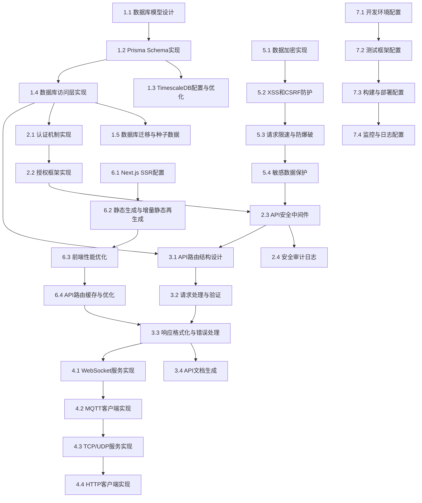

# 基础架构模块任务分解

## 任务分解原则
- 任务原则：能够指导cursor进行代码生成
- 分解粒度：细粒度（具体实现）
- 依赖关系：是
- 优先级：是（P0关键、P1重要、P2可选）
- 估算时间：是（小时/天）

## 功能概述
基础架构模块负责系统的底层架构和基础设施，包括数据库设计与实现、认证授权机制、API框架、通信协议和安全机制等。该模块是整个平台的基石，确保系统稳定、安全和高效运行。

## 任务分解

### 1. 数据库设计与实现 [P0] [5天]
#### 1.1 数据库模型设计
- **功能描述**：设计系统数据库模型，包括各模块的数据表和关系
- **技术实现**：
  - 设计用户与权限相关表结构
  - 设计设备相关表结构
  - 设计规则引擎和任务相关表结构
  - 设计系统管理相关表结构
- **验收标准**：
  - 数据模型设计合理，符合范式要求
  - 表结构完整，字段定义准确
  - 关系设计清晰，外键约束合理
  - 索引设计优化，满足查询需求

#### 1.2 Prisma Schema实现
- **功能描述**：使用Prisma ORM实现数据库模型
- **技术实现**：
  - 创建Prisma Schema文件
  - 定义数据模型和关系
  - 配置索引和约束
  - 实现数据库迁移脚本
- **验收标准**：
  - Prisma模型定义准确
  - 关系映射正确
  - 索引和约束配置合理
  - 迁移脚本可靠执行

#### 1.3 TimescaleDB配置与优化
- **功能描述**：配置TimescaleDB用于时序数据存储
- **技术实现**：
  - 安装和配置TimescaleDB扩展
  - 设计时序数据表结构
  - 实现自动分区策略
  - 配置数据压缩和保留策略
- **验收标准**：
  - TimescaleDB配置正确
  - 时序表结构合理
  - 分区策略高效
  - 压缩和保留策略有效

#### 1.4 数据库访问层实现
- **功能描述**：实现数据库访问层，提供统一的数据操作接口
- **技术实现**：
  - 创建数据库连接管理
  - 实现基础CRUD操作封装
  - 开发事务管理功能
  - 实现查询优化和缓存
- **验收标准**：
  - 连接管理稳定可靠
  - CRUD操作封装完整
  - 事务管理正确
  - 查询性能良好

#### 1.5 数据库迁移与种子数据
- **功能描述**：实现数据库迁移和种子数据功能
- **技术实现**：
  - 创建初始化迁移脚本
  - 实现版本管理和升级脚本
  - 开发种子数据脚本
  - 实现环境特定配置
- **验收标准**：
  - 初始化迁移成功
  - 版本管理有效
  - 种子数据完整
  - 环境配置灵活

### 2. 认证与授权框架 [P0] [4天]
#### 2.1 认证机制实现
- **功能描述**：实现系统认证机制，支持多种认证方式
- **技术实现**：
  - 开发JWT认证实现
  - 实现密码加密和验证
  - 开发刷新令牌机制
  - 实现多因素认证支持
- **验收标准**：
  - JWT认证安全可靠
  - 密码加密强度高
  - 刷新令牌机制有效
  - 多因素认证可选

#### 2.2 授权框架实现
- **功能描述**：实现系统授权框架，支持细粒度权限控制
- **技术实现**：
  - 开发RBAC权限模型
  - 实现权限检查中间件
  - 开发权限缓存机制
  - 实现权限继承和覆盖
- **验收标准**：
  - RBAC模型实现完整
  - 权限检查高效准确
  - 缓存机制有效
  - 继承和覆盖逻辑正确

#### 2.3 API安全中间件
- **功能描述**：实现API安全中间件，保护API访问安全
- **技术实现**：
  - 开发认证中间件
  - 实现CSRF保护
  - 开发请求限速功能
  - 实现安全头部设置
- **验收标准**：
  - 认证中间件可靠
  - CSRF保护有效
  - 限速功能合理
  - 安全头部配置正确

#### 2.4 安全审计日志
- **功能描述**：实现安全审计日志功能，记录关键操作和安全事件
- **技术实现**：
  - 开发日志记录中间件
  - 实现敏感操作审计
  - 开发安全事件记录
  - 实现日志查询和分析
- **验收标准**：
  - 日志记录完整
  - 敏感操作审计准确
  - 安全事件记录及时
  - 查询和分析功能有效

### 3. API框架与路由 [P0] [3天]
#### 3.1 API路由结构设计
- **功能描述**：设计API路由结构，规范API路径和方法
- **技术实现**：
  - 设计RESTful API路由
  - 实现API版本控制
  - 开发动态路由处理
  - 实现路由分组和中间件
- **验收标准**：
  - RESTful设计规范
  - 版本控制合理
  - 动态路由处理正确
  - 分组和中间件有效

#### 3.2 请求处理与验证
- **功能描述**：实现请求处理和数据验证功能
- **技术实现**：
  - 开发请求解析中间件
  - 实现数据验证框架
  - 开发错误处理机制
  - 实现请求上下文管理
- **验收标准**：
  - 请求解析准确
  - 数据验证严格
  - 错误处理完善
  - 上下文管理有效

#### 3.3 响应格式化与错误处理
- **功能描述**：实现响应格式化和统一错误处理
- **技术实现**：
  - 开发响应格式化工具
  - 实现统一错误处理
  - 开发HTTP状态码映射
  - 实现国际化错误消息
- **验收标准**：
  - 响应格式统一
  - 错误处理一致
  - 状态码使用正确
  - 错误消息清晰

#### 3.4 API文档生成
- **功能描述**：实现API文档自动生成功能
- **技术实现**：
  - 集成Swagger/OpenAPI
  - 实现API注释规范
  - 开发文档生成脚本
  - 实现文档部署和更新
- **验收标准**：
  - 文档生成准确
  - 注释规范统一
  - 生成脚本可靠
  - 文档更新及时

### 4. 通信协议实现 [P0] [4天]
#### 4.1 WebSocket服务实现
- **功能描述**：实现WebSocket服务，支持实时数据通信
- **技术实现**：
  - 集成Socket.IO库
  - 实现连接管理和认证
  - 开发事件处理机制
  - 实现房间和命名空间管理
- **验收标准**：
  - WebSocket服务稳定
  - 连接管理可靠
  - 事件处理正确
  - 房间和命名空间管理有效

#### 4.2 MQTT客户端实现
- **功能描述**：实现MQTT客户端，支持与MQTT服务器通信
- **技术实现**：
  - 集成MQTT.js库
  - 实现连接管理和认证
  - 开发主题订阅和发布
  - 实现QoS和消息持久化
- **验收标准**：
  - MQTT客户端稳定
  - 连接管理可靠
  - 订阅和发布功能正常
  - QoS和持久化有效

#### 4.3 TCP/UDP服务实现
- **功能描述**：实现TCP/UDP服务，支持低层网络协议通信
- **技术实现**：
  - 使用Node.js net和dgram模块
  - 实现连接管理和会话
  - 开发数据包解析和处理
  - 实现协议适配和转换
- **验收标准**：
  - TCP/UDP服务稳定
  - 连接和会话管理可靠
  - 数据包处理正确
  - 协议适配和转换有效

#### 4.4 HTTP客户端实现
- **功能描述**：实现HTTP客户端，支持与外部HTTP服务通信
- **技术实现**：
  - 集成Axios库
  - 实现请求配置和拦截器
  - 开发响应处理和错误处理
  - 实现请求重试和超时控制
- **验收标准**：
  - HTTP客户端可靠
  - 配置和拦截器有效
  - 响应和错误处理完善
  - 重试和超时控制合理

### 5. 安全机制实现 [P0] [3天]
#### 5.1 数据加密实现
- **功能描述**：实现数据加密功能，保护敏感数据安全
- **技术实现**：
  - 开发对称加密工具
  - 实现非对称加密工具
  - 开发哈希和签名功能
  - 实现安全密钥管理
- **验收标准**：
  - 对称加密安全可靠
  - 非对称加密正确
  - 哈希和签名功能有效
  - 密钥管理安全

#### 5.2 XSS和CSRF防护
- **功能描述**：实现XSS和CSRF防护功能
- **技术实现**：
  - 开发输入过滤和转义
  - 实现内容安全策略(CSP)
  - 开发CSRF令牌验证
  - 实现安全Cookie设置
- **验收标准**：
  - 输入过滤严格
  - CSP配置有效
  - CSRF令牌验证可靠
  - Cookie设置安全

#### 5.3 请求限速与防爆破
- **功能描述**：实现请求限速和防爆破功能
- **技术实现**：
  - 开发IP限速中间件
  - 实现用户级别限速
  - 开发登录尝试限制
  - 实现异常检测和阻断
- **验收标准**：
  - IP限速有效
  - 用户级别限速合理
  - 登录尝试限制可靠
  - 异常检测准确

#### 5.4 敏感数据保护
- **功能描述**：实现敏感数据保护功能
- **技术实现**：
  - 开发数据脱敏工具
  - 实现字段级加密
  - 开发访问控制检查
  - 实现数据泄露防护
- **验收标准**：
  - 数据脱敏有效
  - 字段级加密安全
  - 访问控制严格
  - 泄露防护可靠

### 6. 服务端渲染与客户端优化 [P1] [3天]
#### 6.1 Next.js SSR配置
- **功能描述**：配置Next.js服务端渲染功能
- **技术实现**：
  - 配置页面渲染策略
  - 实现数据预取和注水
  - 开发动态导入和代码分割
  - 实现缓存和重新验证
- **验收标准**：
  - 渲染策略合理
  - 数据预取和注水正确
  - 代码分割有效
  - 缓存策略优化

#### 6.2 静态生成与增量静态再生成
- **功能描述**：实现静态生成和增量静态再生成功能
- **技术实现**：
  - 配置静态页面生成
  - 实现动态路由静态生成
  - 开发ISR重新验证
  - 实现按需ISR触发
- **验收标准**：
  - 静态生成正确
  - 动态路由处理合理
  - ISR重新验证有效
  - 按需触发可靠

#### 6.3 前端性能优化
- **功能描述**：实现前端性能优化功能
- **技术实现**：
  - 开发图片优化和懒加载
  - 实现字体优化和预加载
  - 开发组件懒加载
  - 实现客户端缓存策略
- **验收标准**：
  - 图片优化有效
  - 字体加载优化
  - 组件懒加载合理
  - 缓存策略有效

#### 6.4 API路由缓存与优化
- **功能描述**：实现API路由缓存和优化功能
- **技术实现**：
  - 开发API路由缓存
  - 实现边缘缓存配置
  - 开发响应压缩
  - 实现条件请求处理
- **验收标准**：
  - API缓存有效
  - 边缘缓存配置正确
  - 响应压缩高效
  - 条件请求处理合理

### 7. 开发与部署工具 [P1] [2天]
#### 7.1 开发环境配置
- **功能描述**：配置开发环境，提高开发效率
- **技术实现**：
  - 配置ESLint和Prettier
  - 实现TypeScript类型检查
  - 开发热重载功能
  - 实现环境变量管理
- **验收标准**：
  - 代码检查有效
  - 类型检查严格
  - 热重载快速
  - 环境变量管理灵活

#### 7.2 测试框架配置
- **功能描述**：配置测试框架，保障代码质量
- **技术实现**：
  - 配置Jest单元测试
  - 实现React组件测试
  - 开发API集成测试
  - 实现端到端测试
- **验收标准**：
  - 单元测试框架可用
  - 组件测试有效
  - 集成测试完整
  - 端到端测试可靠

#### 7.3 构建与部署配置
- **功能描述**：配置构建和部署流程
- **技术实现**：
  - 配置Next.js构建优化
  - 实现静态资源处理
  - 开发环境特定构建
  - 实现Docker容器化
- **验收标准**：
  - 构建优化有效
  - 静态资源处理正确
  - 环境构建合理
  - 容器化配置完整

#### 7.4 监控与日志配置
- **功能描述**：配置监控和日志系统
- **技术实现**：
  - 配置应用性能监控
  - 实现错误跟踪和报告
  - 开发日志收集和存储
  - 实现健康检查和告警
- **验收标准**：
  - 性能监控有效
  - 错误跟踪准确
  - 日志收集完整
  - 健康检查和告警可靠

## 依赖关系图
