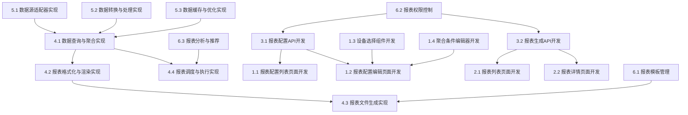

# 报表中心模块任务分解

## 任务分解原则
- 任务原则：能够指导cursor进行代码生成
- 分解粒度：细粒度（具体实现）
- 依赖关系：是
- 优先级：是（P0关键、P1重要、P2可选）
- 估算时间：是（小时/天）

## 功能概述
报表中心模块负责系统中数据报表的配置、生成和导出，包括报表配置管理和报表导出两个子模块。该模块支持用户根据需求配置报表内容、执行方式和聚合条件，并生成可下载的报表文件，是平台数据分析和决策支持的重要工具。

## 任务分解

### 1. 报表配置管理界面 [P0] [3天]
#### 1.1 报表配置列表页面开发
- **功能描述**：开发报表配置列表页面，展示报表配置信息
- **技术实现**：
  - 创建报表配置列表页面组件
  - 实现筛选、搜索和排序功能
  - 开发分页加载
  - 实现批量下载功能和操作入口（编辑）
- **验收标准**：
  - 能够展示报表配置信息
  - 支持按条件筛选和搜索报表配置
  - 分页功能正常，加载性能良好
  - 批量下载和操作入口功能正常

#### 1.2 报表配置编辑页面开发
- **功能描述**：开发报表配置编辑页面，支持报表配置信息的编辑
- **技术实现**：
  - 创建报表配置编辑页面组件
  - 实现表单验证和提交
  - 开发执行方式配置组件
  - 实现设备选择和聚合条件编辑器组件
- **验收标准**：
  - 能够编辑报表配置信息
  - 表单验证有效，提交成功后有反馈
  - 执行方式配置功能完整
  - 设备选择和聚合条件编辑功能正常

#### 1.3 设备选择组件开发
- **功能描述**：开发设备选择组件，支持多选设备
- **技术实现**：
  - 创建设备选择组件
  - 实现设备搜索和筛选
  - 开发设备分组展示
  - 实现已选设备管理
- **验收标准**：
  - 设备选择界面友好
  - 搜索和筛选功能有效
  - 分组展示清晰
  - 已选设备管理便捷

#### 1.4 聚合条件编辑器开发
- **功能描述**：开发聚合条件编辑器组件，支持配置数据聚合条件
- **技术实现**：
  - 创建聚合条件编辑器组件
  - 实现聚合函数选择
  - 开发时间范围配置
  - 实现分组和排序设置
- **验收标准**：
  - 聚合条件编辑界面直观
  - 聚合函数选择完整
  - 时间范围配置灵活
  - 分组和排序设置有效

### 2. 报表导出管理界面 [P0] [2天]
#### 2.1 报表列表页面开发
- **功能描述**：开发报表列表页面，展示已生成的报表信息
- **技术实现**：
  - 创建报表列表页面组件
  - 实现筛选、搜索和排序功能
  - 开发分页加载
  - 实现批量下载功能和操作入口（查看详情、下载报表）
- **验收标准**：
  - 能够展示报表信息
  - 支持按条件筛选和搜索报表
  - 分页功能正常，加载性能良好
  - 批量下载和操作入口功能正常

#### 2.2 报表详情页面开发
- **功能描述**：开发报表详情页面，展示报表数据
- **技术实现**：
  - 创建报表详情页面组件
  - 实现报表数据展示
  - 开发数据可视化组件
  - 实现报表导出功能
- **验收标准**：
  - 能够清晰展示报表数据
  - 数据可视化效果良好
  - 导出功能正常
  - 页面性能良好，支持大量数据

### 3. 报表API接口 [P0] [2天]
#### 3.1 报表配置API开发
- **功能描述**：开发报表配置相关的API接口
- **技术实现**：
  - 创建报表配置CRUD API路由
  - 实现数据验证和错误处理
  - 开发配置状态管理API
  - 实现配置复制API
- **验收标准**：
  - API接口符合RESTful规范
  - 数据验证严格，错误处理完善
  - 状态管理API功能正常
  - 配置复制API功能正确

#### 3.2 报表生成API开发
- **功能描述**：开发报表生成相关的API接口
- **技术实现**：
  - 创建报表生成API
  - 实现报表查询API
  - 开发报表下载API
  - 实现报表删除API
- **验收标准**：
  - 报表生成API功能正常
  - 查询API性能良好
  - 下载API可靠
  - 删除API功能正确

### 4. 报表生成引擎 [P0] [4天]
#### 4.1 数据查询与聚合实现
- **功能描述**：实现报表数据查询和聚合功能
- **技术实现**：
  - 开发数据源连接管理
  - 实现SQL查询生成
  - 开发数据聚合处理
  - 实现查询优化策略
- **验收标准**：
  - 数据源连接稳定
  - SQL查询生成正确
  - 数据聚合结果准确
  - 查询性能良好

#### 4.2 报表格式化与渲染实现
- **功能描述**：实现报表数据格式化和渲染功能
- **技术实现**：
  - 开发数据格式化逻辑
  - 实现表格渲染
  - 开发图表生成
  - 实现样式应用
- **验收标准**：
  - 数据格式化正确
  - 表格渲染美观
  - 图表生成准确
  - 样式应用一致

#### 4.3 报表文件生成实现
- **功能描述**：实现报表文件生成功能
- **技术实现**：
  - 开发Excel文件生成
  - 实现PDF文件生成
  - 开发CSV文件生成
  - 实现文件存储和管理
- **验收标准**：
  - Excel文件格式正确
  - PDF文件排版美观
  - CSV文件编码正确
  - 文件存储安全可靠

#### 4.4 报表调度与执行实现
- **功能描述**：实现报表调度和执行功能
- **技术实现**：
  - 开发报表执行队列
  - 实现定时执行逻辑
  - 开发执行状态管理
  - 实现错误处理和重试
- **验收标准**：
  - 执行队列管理高效
  - 定时执行准时可靠
  - 状态管理准确
  - 错误处理完善

### 5. 报表数据处理 [P1] [3天]
#### 5.1 数据源适配器实现
- **功能描述**：实现各类数据源的适配器
- **技术实现**：
  - 开发TimescaleDB适配器
  - 实现PostgreSQL适配器
  - 开发设备实时数据适配器
  - 实现外部数据源适配器
- **验收标准**：
  - TimescaleDB适配器功能完整
  - PostgreSQL适配器性能良好
  - 设备实时数据适配器可靠
  - 外部数据源适配器扩展性好

#### 5.2 数据转换与处理实现
- **功能描述**：实现数据转换和处理功能
- **技术实现**：
  - 开发数据清洗逻辑
  - 实现数据转换函数
  - 开发数据计算引擎
  - 实现数据验证规则
- **验收标准**：
  - 数据清洗有效
  - 转换函数正确
  - 计算引擎准确
  - 验证规则合理

#### 5.3 数据缓存与优化实现
- **功能描述**：实现数据缓存和查询优化功能
- **技术实现**：
  - 开发查询结果缓存
  - 实现增量数据更新
  - 开发查询计划优化
  - 实现分布式查询
- **验收标准**：
  - 缓存机制有效
  - 增量更新准确
  - 查询计划优化有效
  - 分布式查询高效

### 6. 报表中心高级功能 [P2] [2天]
#### 6.1 报表模板管理
- **功能描述**：实现报表模板管理功能
- **技术实现**：
  - 开发模板创建和管理
  - 实现模板参数化
  - 开发模板预览功能
  - 实现模板版本控制
- **验收标准**：
  - 模板管理功能完整
  - 参数化灵活有效
  - 预览功能准确
  - 版本控制可靠

#### 6.2 报表权限控制
- **功能描述**：实现报表权限控制功能
- **技术实现**：
  - 开发报表访问权限设置
  - 实现数据级权限控制
  - 开发共享和协作功能
  - 实现权限审计日志
- **验收标准**：
  - 访问权限控制有效
  - 数据级权限精确
  - 共享和协作功能实用
  - 审计日志完整

#### 6.3 报表分析与推荐
- **功能描述**：实现报表分析和推荐功能
- **技术实现**：
  - 开发报表使用分析
  - 实现数据洞察功能
  - 开发报表推荐算法
  - 实现自动报表生成
- **验收标准**：
  - 使用分析有价值
  - 数据洞察准确
  - 推荐算法合理
  - 自动生成报表有用

## 依赖关系图
