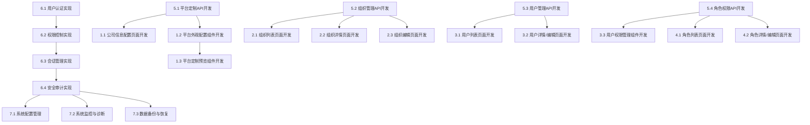

# 系统管理模块任务分解

## 任务分解原则
- 任务原则：能够指导cursor进行代码生成
- 分解粒度：细粒度（具体实现）
- 依赖关系：是
- 优先级：是（P0关键、P1重要、P2可选）
- 估算时间：是（小时/天）

## 功能概述
系统管理模块负责平台的整体配置、组织结构管理和用户权限控制，包括平台定制和组织管理两个子模块。该模块是平台管理和权限控制的核心，确保系统安全可靠运行。

## 任务分解

### 1. 平台定制界面 [P0] [2天]
#### 1.1 公司信息配置页面开发
- **功能描述**：开发公司信息配置页面，支持平台品牌标识和外观配置
- **技术实现**：
  - 创建公司信息配置页面组件
  - 实现表单验证和提交
  - 开发图片上传和预览功能
  - 实现主题色选择功能
- **验收标准**：
  - 能够配置公司基本信息
  - 表单验证有效，提交成功后有反馈
  - 图片上传和预览功能正常
  - 主题色选择功能完整

#### 1.2 平台外观配置组件开发
- **功能描述**：开发平台外观配置组件，支持自定义平台样式
- **技术实现**：
  - 创建外观配置组件
  - 实现Logo和图标上传
  - 开发颜色方案设置
  - 实现布局选项配置
- **验收标准**：
  - 外观配置界面友好
  - Logo和图标上传功能正常
  - 颜色方案设置有效
  - 布局选项配置完整

#### 1.3 平台定制预览组件开发
- **功能描述**：开发平台定制预览组件，实时展示配置效果
- **技术实现**：
  - 创建预览组件
  - 实现实时预览更新
  - 开发多设备预览
  - 实现配置应用功能
- **验收标准**：
  - 预览效果真实
  - 实时更新流畅
  - 多设备预览准确
  - 配置应用功能正常

### 2. 组织管理界面 [P0] [3天]
#### 2.1 组织列表页面开发
- **功能描述**：开发组织列表页面，展示组织信息
- **技术实现**：
  - 创建组织列表页面组件
  - 实现筛选、搜索和排序功能
  - 开发树形结构展示
  - 实现操作入口（查看详情、编辑、删除、添加子组织）
- **验收标准**：
  - 能够展示组织信息
  - 支持按条件筛选和搜索组织
  - 树形结构清晰直观
  - 操作入口功能正常

#### 2.2 组织详情页面开发
- **功能描述**：开发组织详情页面，展示组织详细信息和下属组织
- **技术实现**：
  - 创建组织详情页面组件
  - 实现组织信息展示
  - 开发下属组织列表
  - 实现关联资源查看
- **验收标准**：
  - 能够展示组织详细信息
  - 下属组织列表完整
  - 关联资源查看功能正常
  - 页面布局合理，信息清晰

#### 2.3 组织编辑页面开发
- **功能描述**：开发组织编辑页面，支持组织信息的编辑
- **技术实现**：
  - 创建组织编辑页面组件
  - 实现表单验证和提交
  - 开发上级组织选择功能
  - 实现组织编码生成规则
- **验收标准**：
  - 能够编辑组织信息
  - 表单验证有效，提交成功后有反馈
  - 上级组织选择功能完整
  - 组织编码生成规则合理

### 3. 用户管理界面 [P0] [3天]
#### 3.1 用户列表页面开发
- **功能描述**：开发用户列表页面，展示用户信息
- **技术实现**：
  - 创建用户列表页面组件
  - 实现筛选、搜索和排序功能
  - 开发分页加载
  - 实现操作入口（查看详情、编辑、删除、重置密码）
- **验收标准**：
  - 能够展示用户信息
  - 支持按条件筛选和搜索用户
  - 分页功能正常，加载性能良好
  - 操作入口功能正常

#### 3.2 用户详情/编辑页面开发
- **功能描述**：开发用户详情/编辑页面，支持用户信息的查看和编辑
- **技术实现**：
  - 创建用户详情/编辑页面组件
  - 实现表单验证和提交
  - 开发角色分配功能
  - 实现组织选择功能
- **验收标准**：
  - 能够查看和编辑用户信息
  - 表单验证有效，提交成功后有反馈
  - 角色分配功能完整
  - 组织选择功能正常

#### 3.3 用户权限管理组件开发
- **功能描述**：开发用户权限管理组件，支持用户权限的配置
- **技术实现**：
  - 创建权限管理组件
  - 实现权限树形展示
  - 开发权限分配功能
  - 实现权限继承和覆盖
- **验收标准**：
  - 权限管理界面清晰
  - 权限树形展示直观
  - 权限分配功能有效
  - 权限继承和覆盖逻辑正确

### 4. 角色管理界面 [P0] [2天]
#### 4.1 角色列表页面开发
- **功能描述**：开发角色列表页面，展示角色信息
- **技术实现**：
  - 创建角色列表页面组件
  - 实现筛选和搜索功能
  - 开发分页加载
  - 实现操作入口（查看详情、编辑、删除）
- **验收标准**：
  - 能够展示角色信息
  - 支持按条件筛选和搜索角色
  - 分页功能正常，加载性能良好
  - 操作入口功能正常

#### 4.2 角色详情/编辑页面开发
- **功能描述**：开发角色详情/编辑页面，支持角色信息的查看和编辑
- **技术实现**：
  - 创建角色详情/编辑页面组件
  - 实现表单验证和提交
  - 开发权限配置功能
  - 实现用户分配功能
- **验收标准**：
  - 能够查看和编辑角色信息
  - 表单验证有效，提交成功后有反馈
  - 权限配置功能完整
  - 用户分配功能正常

### 5. 系统管理API接口 [P0] [3天]
#### 5.1 平台定制API开发
- **功能描述**：开发平台定制相关的API接口
- **技术实现**：
  - 创建平台定制API路由
  - 实现数据验证和错误处理
  - 开发图片上传和处理API
  - 实现配置应用和恢复API
- **验收标准**：
  - API接口符合RESTful规范
  - 数据验证严格，错误处理完善
  - 图片上传和处理功能安全可靠
  - 配置应用和恢复功能正常

#### 5.2 组织管理API开发
- **功能描述**：开发组织管理相关的API接口
- **技术实现**：
  - 创建组织CRUD API路由
  - 实现数据验证和错误处理
  - 开发组织树查询API
  - 实现组织移动和合并API
- **验收标准**：
  - API接口符合RESTful规范
  - 数据验证严格，错误处理完善
  - 组织树查询性能良好
  - 组织移动和合并功能正确

#### 5.3 用户管理API开发
- **功能描述**：开发用户管理相关的API接口
- **技术实现**：
  - 创建用户CRUD API路由
  - 实现数据验证和错误处理
  - 开发用户认证和授权API
  - 实现密码管理API
- **验收标准**：
  - API接口符合RESTful规范
  - 数据验证严格，错误处理完善
  - 用户认证和授权功能安全
  - 密码管理功能可靠

#### 5.4 角色权限API开发
- **功能描述**：开发角色权限相关的API接口
- **技术实现**：
  - 创建角色CRUD API路由
  - 实现权限CRUD API路由
  - 开发角色权限分配API
  - 实现权限检查API
- **验收标准**：
  - API接口符合RESTful规范
  - 数据验证严格，错误处理完善
  - 角色权限分配功能正确
  - 权限检查API高效可靠

### 6. 认证与授权系统 [P0] [4天]
#### 6.1 用户认证实现
- **功能描述**：实现用户认证功能
- **技术实现**：
  - 开发用户名密码认证
  - 实现JWT令牌生成和验证
  - 开发多因素认证
  - 实现单点登录
- **验收标准**：
  - 用户名密码认证安全可靠
  - JWT令牌管理完善
  - 多因素认证可选启用
  - 单点登录功能正常

#### 6.2 权限控制实现
- **功能描述**：实现基于角色的权限控制功能
- **技术实现**：
  - 开发RBAC权限模型
  - 实现API访问控制
  - 开发UI权限控制
  - 实现数据权限控制
- **验收标准**：
  - RBAC模型设计合理
  - API访问控制有效
  - UI权限控制准确
  - 数据权限控制精确

#### 6.3 会话管理实现
- **功能描述**：实现用户会话管理功能
- **技术实现**：
  - 开发会话创建和销毁
  - 实现会话状态维护
  - 开发会话超时处理
  - 实现并发会话控制
- **验收标准**：
  - 会话管理可靠
  - 状态维护准确
  - 超时处理合理
  - 并发控制有效

#### 6.4 安全审计实现
- **功能描述**：实现安全审计功能
- **技术实现**：
  - 开发用户操作日志
  - 实现安全事件记录
  - 开发审计日志查询
  - 实现异常行为检测
- **验收标准**：
  - 操作日志完整
  - 安全事件记录准确
  - 审计日志查询高效
  - 异常行为检测有效

### 7. 系统管理高级功能 [P2] [2天]
#### 7.1 系统配置管理
- **功能描述**：实现系统配置管理功能
- **技术实现**：
  - 开发配置项管理
  - 实现配置分类和分组
  - 开发配置导入导出
  - 实现配置版本控制
- **验收标准**：
  - 配置项管理完整
  - 分类和分组合理
  - 导入导出功能正常
  - 版本控制可靠

#### 7.2 系统监控与诊断
- **功能描述**：实现系统监控和诊断功能
- **技术实现**：
  - 开发系统资源监控
  - 实现性能指标收集
  - 开发健康检查功能
  - 实现问题诊断工具
- **验收标准**：
  - 资源监控准确
  - 性能指标完整
  - 健康检查有效
  - 诊断工具实用

#### 7.3 数据备份与恢复
- **功能描述**：实现数据备份和恢复功能
- **技术实现**：
  - 开发自动备份策略
  - 实现手动备份功能
  - 开发数据恢复流程
  - 实现备份管理功能
- **验收标准**：
  - 自动备份可靠
  - 手动备份功能完整
  - 数据恢复准确
  - 备份管理便捷

## 依赖关系图
