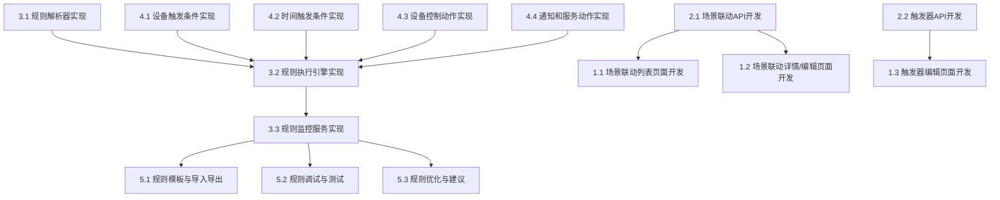

# 规则引擎模块任务分解

## 任务分解原则
- 任务原则：能够指导cursor进行代码生成
- 分解粒度：细粒度（具体实现）
- 依赖关系：是
- 优先级：是（P0关键、P1重要、P2可选）
- 估算时间：是（小时/天）

## 功能概述
规则引擎模块负责场景联动规则的配置、执行和触发，通过配置触发条件、执行动作和执行条件，实现设备与设备之间、设备与应用之间的联动，是平台自动化控制的核心组件。

## 任务分解

### 1. 场景联动管理界面 [P0] [3天]
#### 1.1 场景联动列表页面开发
- **功能描述**：开发场景联动列表页面，展示场景联动信息
- **技术实现**：
  - 创建场景联动列表页面组件
  - 实现筛选、搜索和排序功能
  - 开发分页加载
  - 实现操作入口（查看详情、编辑、新建触发器、编辑触发条件）
- **验收标准**：
  - 能够展示场景联动信息
  - 支持按条件筛选和搜索场景联动
  - 分页功能正常，加载性能良好
  - 操作入口清晰，交互友好

#### 1.2 场景联动详情/编辑页面开发
- **功能描述**：开发场景联动详情/编辑页面，支持场景联动信息的查看和编辑
- **技术实现**：
  - 创建场景联动详情/编辑页面组件
  - 实现表单验证和提交
  - 开发触发方式选择功能
  - 实现状态切换功能
- **验收标准**：
  - 能够查看和编辑场景联动详细信息
  - 表单验证有效，提交成功后有反馈
  - 触发方式选择功能完整
  - 状态切换功能正常

#### 1.3 触发器编辑页面开发
- **功能描述**：开发触发器编辑页面，支持触发条件、执行动作和执行条件的配置
- **技术实现**：
  - 创建触发器编辑页面组件
  - 开发可视化条件编辑器组件
  - 开发可视化动作编辑器组件
  - 实现执行条件配置功能
- **验收标准**：
  - 能够配置触发条件、执行动作和执行条件
  - 可视化编辑器操作直观，易于使用
  - 配置保存和加载功能正常
  - 提供丰富的条件和动作类型

### 2. 规则引擎API接口 [P0] [2天]
#### 2.1 场景联动API开发
- **功能描述**：开发场景联动相关的API接口
- **技术实现**：
  - 创建场景联动CRUD API路由
  - 实现数据验证和错误处理
  - 开发场景联动状态管理API
  - 实现场景联动执行记录查询API
- **验收标准**：
  - API接口符合RESTful规范
  - 数据验证严格，错误处理完善
  - 状态管理API功能正常
  - 执行记录查询API性能良好

#### 2.2 触发器API开发
- **功能描述**：开发触发器相关的API接口
- **技术实现**：
  - 创建触发器CRUD API路由
  - 实现触发条件和执行动作的验证
  - 开发触发器测试API
  - 实现触发器执行记录查询API
- **验收标准**：
  - API接口符合RESTful规范
  - 条件和动作验证有效
  - 触发器测试API功能正常
  - 执行记录查询API性能良好

### 3. 规则引擎核心实现 [P0] [4天]
#### 3.1 规则解析器实现
- **功能描述**：实现规则解析器，用于解析和验证规则定义
- **技术实现**：
  - 开发规则语法解析器
  - 实现规则验证逻辑
  - 开发规则优化功能
  - 实现规则转换为可执行形式
- **验收标准**：
  - 规则解析准确无误
  - 规则验证有效，能检测出错误
  - 规则优化功能有效
  - 规则转换结果正确

#### 3.2 规则执行引擎实现
- **功能描述**：实现规则执行引擎，用于执行触发条件匹配和动作执行
- **技术实现**：
  - 开发条件匹配算法
  - 实现动作执行框架
  - 开发执行条件评估逻辑
  - 实现执行结果处理
- **验收标准**：
  - 条件匹配准确可靠
  - 动作执行成功，无副作用
  - 执行条件评估正确
  - 执行结果处理完整

#### 3.3 规则监控服务实现
- **功能描述**：实现规则监控服务，用于监控规则执行状态和结果
- **技术实现**：
  - 开发规则执行日志记录
  - 实现规则性能监控
  - 开发规则异常检测
  - 实现规则统计分析
- **验收标准**：
  - 执行日志记录完整
  - 性能监控数据准确
  - 异常检测灵敏有效
  - 统计分析结果有用

### 4. 条件和动作类型实现 [P1] [3天]
#### 4.1 设备触发条件实现
- **功能描述**：实现设备相关的触发条件类型
- **技术实现**：
  - 开发设备状态条件
  - 实现设备属性条件
  - 开发设备事件条件
  - 实现设备告警条件
- **验收标准**：
  - 设备状态条件判断准确
  - 设备属性条件支持多种比较运算
  - 设备事件条件能正确识别事件
  - 设备告警条件能正确识别告警

#### 4.2 时间触发条件实现
- **功能描述**：实现时间相关的触发条件类型
- **技术实现**：
  - 开发定时触发条件
  - 实现周期性触发条件
  - 开发日期范围条件
  - 实现时间段条件
- **验收标准**：
  - 定时触发准时可靠
  - 周期性触发按设定频率执行
  - 日期范围条件判断准确
  - 时间段条件判断准确

#### 4.3 设备控制动作实现
- **功能描述**：实现设备控制相关的执行动作类型
- **技术实现**：
  - 开发设备命令动作
  - 实现设备属性设置动作
  - 开发设备状态切换动作
  - 实现批量设备控制动作
- **验收标准**：
  - 设备命令动作执行成功
  - 设备属性设置动作有效
  - 设备状态切换动作可靠
  - 批量设备控制动作高效

#### 4.4 通知和服务动作实现
- **功能描述**：实现通知和服务调用相关的执行动作类型
- **技术实现**：
  - 开发消息通知动作
  - 实现邮件发送动作
  - 开发HTTP请求动作
  - 实现数据记录动作
- **验收标准**：
  - 消息通知动作送达及时
  - 邮件发送动作可靠
  - HTTP请求动作执行正确
  - 数据记录动作准确完整

### 5. 规则引擎高级功能 [P2] [2天]
#### 5.1 规则模板与导入导出
- **功能描述**：实现规则模板和规则导入导出功能
- **技术实现**：
  - 开发规则模板管理
  - 实现规则导出功能
  - 开发规则导入功能
  - 实现规则版本控制
- **验收标准**：
  - 规则模板管理功能完整
  - 规则导出格式标准
  - 规则导入验证严格
  - 版本控制功能有效

#### 5.2 规则调试与测试
- **功能描述**：实现规则调试和测试功能
- **技术实现**：
  - 开发规则模拟执行功能
  - 实现条件测试工具
  - 开发动作测试工具
  - 实现执行日志查看
- **验收标准**：
  - 规则模拟执行结果准确
  - 条件测试工具有效
  - 动作测试工具可靠
  - 执行日志清晰详细

#### 5.3 规则优化与建议
- **功能描述**：实现规则优化和建议功能
- **技术实现**：
  - 开发规则性能分析
  - 实现规则冲突检测
  - 开发规则优化建议
  - 实现自动修复功能
- **验收标准**：
  - 性能分析结果有参考价值
  - 冲突检测准确可靠
  - 优化建议合理有效
  - 自动修复功能安全可靠

## 依赖关系图
