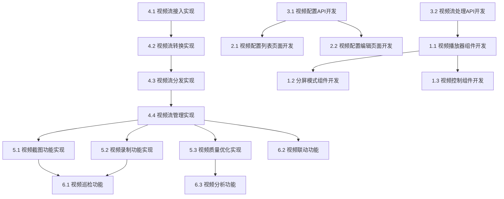

# 视频中心模块任务分解

## 任务分解原则
- 任务原则：能够指导cursor进行代码生成
- 分解粒度：细粒度（具体实现）
- 依赖关系：是
- 优先级：是（P0关键、P1重要、P2可选）
- 估算时间：是（小时/天）

## 功能概述
视频中心模块负责摄像头视频流的接入、管理和展示，支持使用ws://或http://的流媒体协议接入摄像头，提供视频流配置管理和多画面展示功能，是平台视频监控的核心组件。

## 任务分解

### 1. 视频展示界面 [P0] [3天]
#### 1.1 视频播放器组件开发
- **功能描述**：开发视频播放器组件，支持ws://或http://的流媒体播放
- **技术实现**：
  - 创建视频播放器组件
  - 实现WebSocket流媒体播放
  - 开发HTTP流媒体播放
  - 实现播放控制功能
- **验收标准**：
  - 能够播放WebSocket流媒体
  - 能够播放HTTP流媒体
  - 播放控制功能正常
  - 播放性能良好，延迟低

#### 1.2 分屏模式组件开发
- **功能描述**：开发分屏模式组件，支持单屏、四宫格和九宫格显示
- **技术实现**：
  - 创建分屏容器组件
  - 实现布局切换逻辑
  - 开发屏幕选择功能
  - 实现全屏显示功能
- **验收标准**：
  - 支持单屏、四宫格和九宫格模式
  - 布局切换流畅
  - 屏幕选择功能正常
  - 全屏显示功能正常

#### 1.3 视频控制组件开发
- **功能描述**：开发视频控制组件，提供视频播放控制功能
- **技术实现**：
  - 创建视频控制组件
  - 实现播放/暂停控制
  - 开发截图功能
  - 实现录制功能
- **验收标准**：
  - 控制界面友好
  - 播放/暂停控制有效
  - 截图功能正常
  - 录制功能可靠

### 2. 视频配置管理界面 [P0] [2天]
#### 2.1 视频配置列表页面开发
- **功能描述**：开发视频配置列表页面，展示视频配置信息
- **技术实现**：
  - 创建视频配置列表页面组件
  - 实现筛选、搜索和排序功能
  - 开发分页加载
  - 实现操作入口（查看视频预览、编辑配置、删除、启用/停用）
- **验收标准**：
  - 能够展示视频配置信息
  - 支持按条件筛选和搜索视频配置
  - 分页功能正常，加载性能良好
  - 操作入口功能正常

#### 2.2 视频配置编辑页面开发
- **功能描述**：开发视频配置编辑页面，支持视频配置信息的编辑
- **技术实现**：
  - 创建视频配置编辑页面组件
  - 实现表单验证和提交
  - 开发视频流地址测试功能
  - 实现视频流获取方式选择
- **验收标准**：
  - 能够编辑视频配置信息
  - 表单验证有效，提交成功后有反馈
  - 视频流地址测试功能有效
  - 视频流获取方式选择功能完整

### 3. 视频流API接口 [P0] [2天]
#### 3.1 视频配置API开发
- **功能描述**：开发视频配置相关的API接口
- **技术实现**：
  - 创建视频配置CRUD API路由
  - 实现数据验证和错误处理
  - 开发配置状态管理API
  - 实现视频流测试API
- **验收标准**：
  - API接口符合RESTful规范
  - 数据验证严格，错误处理完善
  - 状态管理API功能正常
  - 视频流测试API可靠

#### 3.2 视频流处理API开发
- **功能描述**：开发视频流处理相关的API接口
- **技术实现**：
  - 创建WebSocket视频流API
  - 实现HTTP视频流API
  - 开发视频截图API
  - 实现视频录制API
- **验收标准**：
  - WebSocket视频流API性能良好
  - HTTP视频流API可靠
  - 视频截图API功能正常
  - 视频录制API功能完整

### 4. 视频流处理服务 [P0] [4天]
#### 4.1 视频流接入实现
- **功能描述**：实现视频流接入功能，支持连接摄像头
- **技术实现**：
  - 开发RTSP流接入
  - 实现RTMP流接入
  - 开发HTTP流接入
  - 实现自定义协议接入
- **验收标准**：
  - RTSP流接入稳定
  - RTMP流接入可靠
  - HTTP流接入正常
  - 自定义协议接入灵活

#### 4.2 视频流转换实现
- **功能描述**：实现视频流格式转换功能
- **技术实现**：
  - 开发RTSP转WebSocket流
  - 实现RTMP转WebSocket流
  - 开发视频编码转换
  - 实现视频分辨率调整
- **验收标准**：
  - 转换过程稳定
  - 转换质量良好
  - 编码转换正确
  - 分辨率调整有效

#### 4.3 视频流分发实现
- **功能描述**：实现视频流分发功能，支持多客户端同时观看
- **技术实现**：
  - 开发WebSocket流分发
  - 实现HTTP流分发
  - 开发流复用优化
  - 实现负载均衡
- **验收标准**：
  - WebSocket流分发稳定
  - HTTP流分发可靠
  - 流复用优化有效
  - 负载均衡合理

#### 4.4 视频流管理实现
- **功能描述**：实现视频流管理功能
- **技术实现**：
  - 开发流连接管理
  - 实现流状态监控
  - 开发流错误处理
  - 实现流资源回收
- **验收标准**：
  - 连接管理可靠
  - 状态监控准确
  - 错误处理完善
  - 资源回收及时

### 5. 视频处理功能 [P1] [3天]
#### 5.1 视频截图功能实现
- **功能描述**：实现视频截图功能
- **技术实现**：
  - 开发服务端截图
  - 实现客户端截图
  - 开发截图存储
  - 实现截图下载
- **验收标准**：
  - 服务端截图质量好
  - 客户端截图功能正常
  - 截图存储可靠
  - 截图下载功能完整

#### 5.2 视频录制功能实现
- **功能描述**：实现视频录制功能
- **技术实现**：
  - 开发服务端录制
  - 实现客户端录制
  - 开发录制文件管理
  - 实现录制参数配置
- **验收标准**：
  - 服务端录制稳定
  - 客户端录制功能正常
  - 文件管理完善
  - 参数配置灵活

#### 5.3 视频质量优化实现
- **功能描述**：实现视频质量优化功能
- **技术实现**：
  - 开发自适应码率
  - 实现画质增强
  - 开发网络适应性优化
  - 实现延迟控制
- **验收标准**：
  - 自适应码率有效
  - 画质增强明显
  - 网络适应性好
  - 延迟控制有效

### 6. 视频中心高级功能 [P2] [2天]
#### 6.1 视频巡检功能
- **功能描述**：实现视频巡检功能，支持自动轮巡多个摄像头
- **技术实现**：
  - 开发巡检计划管理
  - 实现自动轮巡逻辑
  - 开发巡检记录
  - 实现异常检测和告警
- **验收标准**：
  - 巡检计划管理完整
  - 自动轮巡正常
  - 巡检记录准确
  - 异常检测灵敏

#### 6.2 视频联动功能
- **功能描述**：实现视频与其他系统的联动功能
- **技术实现**：
  - 开发事件触发联动
  - 实现设备状态联动
  - 开发报警联动
  - 实现场景联动
- **验收标准**：
  - 事件触发联动准确
  - 设备状态联动及时
  - 报警联动可靠
  - 场景联动有效

#### 6.3 视频分析功能
- **功能描述**：实现基础视频分析功能
- **技术实现**：
  - 开发移动侦测
  - 实现区域入侵检测
  - 开发视频异常检测
  - 实现简单目标计数
- **验收标准**：
  - 移动侦测准确
  - 区域入侵检测可靠
  - 视频异常检测有效
  - 目标计数基本准确

## 依赖关系图
