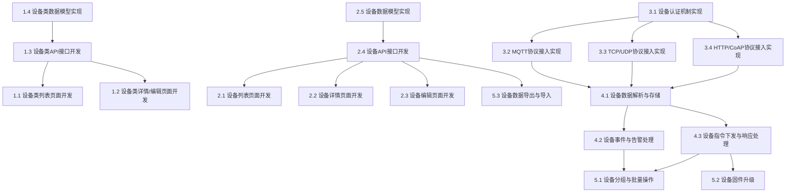

# 设备管理模块任务分解

## 任务分解原则
- 任务原则：能够指导cursor进行代码生成
- 分解粒度：细粒度（具体实现）
- 依赖关系：是
- 优先级：是（P0关键、P1重要、P2可选）
- 估算时间：是（小时/天）

## 功能概述
设备管理模块包含设备类管理和设备管理两个子模块，负责物联网设备的配置、管理和监控。设备类管理提供设备连接模板的配置功能，设备管理则用于查看和管理具体设备的状态和操作。

## 任务分解

### 1. 设备类管理 [P0] [4天]
#### 1.1 设备类列表页面开发
- **功能描述**：开发设备类列表页面，支持列表和卡片两种展示模式
- **技术实现**：
  - 创建设备类列表页面组件
  - 实现列表/卡片视图切换功能
  - 开发筛选、搜索和排序功能
  - 实现分页加载
- **验收标准**：
  - 能够以列表和卡片两种模式展示设备类信息
  - 支持按条件筛选和搜索设备类
  - 分页功能正常，加载性能良好

#### 1.2 设备类详情/编辑页面开发
- **功能描述**：开发设备类详情/编辑页面，支持设备类信息的查看和编辑
- **技术实现**：
  - 创建设备类详情/编辑页面组件
  - 实现表单验证和提交
  - 开发图片上传和预览功能
  - 实现协议选择和配置功能
- **验收标准**：
  - 能够查看和编辑设备类详细信息
  - 表单验证有效，提交成功后有反馈
  - 图片上传和预览功能正常
  - 协议选择和配置功能完整

#### 1.3 设备类API接口开发
- **功能描述**：开发设备类相关的API接口
- **技术实现**：
  - 创建设备类CRUD API路由
  - 实现数据验证和错误处理
  - 开发图片上传和存储功能
  - 实现设备类默认值设置API
- **验收标准**：
  - API接口符合RESTful规范
  - 数据验证严格，错误处理完善
  - 图片上传和存储功能安全可靠
  - 设备类默认值设置功能正常

#### 1.4 设备类数据模型实现
- **功能描述**：实现设备类的数据模型和数据库操作
- **技术实现**：
  - 使用Prisma定义设备类模型
  - 实现数据库查询和操作函数
  - 开发数据验证和转换逻辑
  - 实现数据关联查询
- **验收标准**：
  - 数据模型设计合理，字段完整
  - 数据库操作安全高效
  - 数据验证和转换逻辑正确
  - 关联查询功能正常

### 2. 设备管理 [P0] [5天]
#### 2.1 设备列表页面开发
- **功能描述**：开发设备列表页面，展示设备信息和状态
- **技术实现**：
  - 创建设备列表页面组件
  - 实现设备状态实时更新
  - 开发筛选、搜索和排序功能
  - 实现分页加载
- **验收标准**：
  - 能够展示设备信息和实时状态
  - 支持按条件筛选和搜索设备
  - 分页功能正常，加载性能良好
  - 设备状态更新及时

#### 2.2 设备详情页面开发
- **功能描述**：开发设备详情页面，展示设备详细信息和相关记录
- **技术实现**：
  - 创建设备详情页面组件
  - 实现基本信息、告警事项、命令记录、事件管理和关联任务等子页面
  - 开发数据加载和刷新功能
  - 实现操作入口和交互
- **验收标准**：
  - 能够展示设备详细信息和各类记录
  - 子页面切换流畅，数据加载正常
  - 操作入口清晰，交互友好
  - 数据更新及时

#### 2.3 设备编辑页面开发
- **功能描述**：开发设备编辑页面，支持设备信息的编辑
- **技术实现**：
  - 创建设备编辑页面组件
  - 实现表单验证和提交
  - 开发设备配置编辑功能
  - 实现关联数据选择功能
- **验收标准**：
  - 能够编辑设备基本信息和配置
  - 表单验证有效，提交成功后有反馈
  - 设备配置编辑功能完整
  - 关联数据选择功能正常

#### 2.4 设备API接口开发
- **功能描述**：开发设备相关的API接口
- **技术实现**：
  - 创建设备CRUD API路由
  - 实现设备状态、告警、命令、事件等查询API
  - 开发设备控制API
  - 实现数据验证和错误处理
- **验收标准**：
  - API接口符合RESTful规范
  - 数据验证严格，错误处理完善
  - 设备控制API安全可靠
  - 查询API性能良好

#### 2.5 设备数据模型实现
- **功能描述**：实现设备的数据模型和数据库操作
- **技术实现**：
  - 使用Prisma定义设备相关模型
  - 实现数据库查询和操作函数
  - 开发数据验证和转换逻辑
  - 实现数据关联查询
- **验收标准**：
  - 数据模型设计合理，字段完整
  - 数据库操作安全高效
  - 数据验证和转换逻辑正确
  - 关联查询功能正常

### 3. 设备接入与通信 [P0] [3天]
#### 3.1 设备认证机制实现
- **功能描述**：实现设备认证机制，确保只有合法设备能够接入平台
- **技术实现**：
  - 开发设备认证API
  - 实现身份验证和权限控制
  - 开发设备注册流程
  - 实现密钥管理功能
- **验收标准**：
  - 设备认证安全可靠
  - 身份验证和权限控制有效
  - 设备注册流程完整
  - 密钥管理功能安全

#### 3.2 MQTT协议接入实现
- **功能描述**：实现MQTT协议的设备接入功能
- **技术实现**：
  - 集成MQTT.js库
  - 实现MQTT服务器连接和管理
  - 开发主题订阅和消息处理
  - 实现消息发布功能
- **验收标准**：
  - MQTT连接稳定可靠
  - 主题订阅和消息处理正确
  - 消息发布功能正常
  - 支持QoS设置

#### 3.3 TCP/UDP协议接入实现
- **功能描述**：实现TCP/UDP协议的设备接入功能
- **技术实现**：
  - 使用Node.js net和dgram模块
  - 实现TCP/UDP服务器创建和管理
  - 开发数据包解析和处理
  - 实现数据发送功能
- **验收标准**：
  - TCP/UDP服务器稳定运行
  - 数据包解析和处理正确
  - 数据发送功能正常
  - 连接管理有效

#### 3.4 HTTP/CoAP协议接入实现
- **功能描述**：实现HTTP和CoAP协议的设备接入功能
- **技术实现**：
  - 创建HTTP设备接入API
  - 集成node-coap库
  - 实现请求解析和处理
  - 开发响应生成功能
- **验收标准**：
  - HTTP和CoAP接入功能正常
  - 请求解析和处理正确
  - 响应生成功能完整
  - 支持异步通信

### 4. 设备数据处理 [P1] [2天]
#### 4.1 设备数据解析与存储
- **功能描述**：实现设备数据的解析和存储功能
- **技术实现**：
  - 开发数据解析器
  - 实现数据验证和转换
  - 使用TimescaleDB存储时序数据
  - 开发数据压缩和归档策略
- **验收标准**：
  - 数据解析准确无误
  - 数据验证和转换正确
  - 时序数据存储高效
  - 数据压缩和归档有效

#### 4.2 设备事件与告警处理
- **功能描述**：实现设备事件和告警的处理功能
- **技术实现**：
  - 开发事件检测和生成逻辑
  - 实现告警规则引擎
  - 开发告警通知机制
  - 实现事件和告警存储
- **验收标准**：
  - 事件检测和生成准确
  - 告警规则执行正确
  - 告警通知及时有效
  - 事件和告警存储完整

#### 4.3 设备指令下发与响应处理
- **功能描述**：实现设备指令下发和响应处理功能
- **技术实现**：
  - 开发指令生成和格式化功能
  - 实现多协议指令下发
  - 开发响应解析和处理
  - 实现指令状态跟踪
- **验收标准**：
  - 指令生成和格式化正确
  - 多协议指令下发成功
  - 响应解析和处理准确
  - 指令状态跟踪完整

### 5. 设备管理高级功能 [P2] [2天]
#### 5.1 设备分组与批量操作
- **功能描述**：实现设备分组和批量操作功能
- **技术实现**：
  - 开发设备分组管理功能
  - 实现批量命令下发
  - 开发批量配置更新
  - 实现分组数据统计
- **验收标准**：
  - 设备分组管理功能完整
  - 批量命令下发成功
  - 批量配置更新有效
  - 分组数据统计准确

#### 5.2 设备固件升级
- **功能描述**：实现设备固件升级功能
- **技术实现**：
  - 开发固件管理功能
  - 实现固件版本控制
  - 开发固件下发和升级流程
  - 实现升级状态监控
- **验收标准**：
  - 固件管理功能完整
  - 固件版本控制有效
  - 固件下发和升级成功
  - 升级状态监控准确

#### 5.3 设备数据导出与导入
- **功能描述**：实现设备数据的导出和导入功能
- **技术实现**：
  - 开发数据导出功能
  - 实现数据格式转换
  - 开发数据导入功能
  - 实现数据验证和冲突处理
- **验收标准**：
  - 数据导出功能完整
  - 数据格式转换正确
  - 数据导入功能有效
  - 数据验证和冲突处理准确

## 依赖关系图
