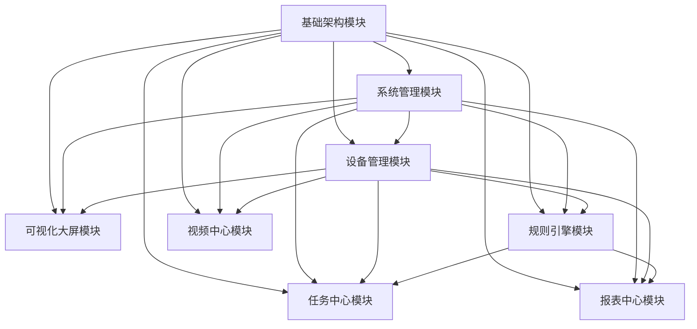

# 准望物联监测平台编码大纲

## 模块优先级

根据各模块的重要性和依赖关系，我们将模块按以下优先级排序：

### 第一阶段（核心基础）
1. **基础架构模块** [P0]
   - 数据库设计与实现
   - 认证与授权框架
   - API框架与路由
   - 通信协议实现
   - 安全机制实现

2. **系统管理模块** [P0]
   - 用户认证实现
   - 权限控制实现
   - 组织管理API开发
   - 用户管理API开发

### 第二阶段（核心业务）
3. **设备管理模块** [P0]
   - 设备类管理
   - 设备管理
   - 设备接入与通信

4. **可视化大屏模块** [P0]
   - 大屏容器组件开发
   - 可视化组件库开发

5. **规则引擎模块** [P0]
   - 规则引擎核心实现
   - 规则引擎API接口

### 第三阶段（扩展功能）
6. **任务中心模块** [P0]
   - 任务调度系统
   - 任务API接口

7. **视频中心模块** [P0]
   - 视频流处理服务
   - 视频展示界面

8. **报表中心模块** [P0]
   - 报表生成引擎
   - 报表API接口

## 模块间依赖关系

## 详细开发顺序

### 1. 基础架构模块
1. 数据库设计与实现
   - 数据库模型设计
   - Prisma Schema实现
   - TimescaleDB配置与优化
   - 数据库访问层实现

2. 认证与授权框架
   - 认证机制实现
   - 授权框架实现
   - API安全中间件

3. API框架与路由
   - API路由结构设计
   - 请求处理与验证
   - 响应格式化与错误处理

4. 通信协议实现
   - WebSocket服务实现
   - MQTT客户端实现
   - TCP/UDP服务实现
   - HTTP客户端实现

5. 安全机制实现
   - 数据加密实现
   - XSS和CSRF防护
   - 请求限速与防爆破

### 2. 系统管理模块
1. 用户认证实现
2. 权限控制实现
3. 组织管理API开发
4. 用户管理API开发
5. 角色权限API开发
6. 平台定制API开发
7. 组织管理界面开发
8. 用户管理界面开发
9. 角色管理界面开发
10. 平台定制界面开发

### 3. 设备管理模块
1. 设备类数据模型实现
2. 设备数据模型实现
3. 设备认证机制实现
4. 设备类API接口开发
5. 设备API接口开发
6. MQTT协议接入实现
7. TCP/UDP协议接入实现
8. HTTP/CoAP协议接入实现
9. 设备数据解析与存储
10. 设备类列表/详情/编辑页面开发
11. 设备列表/详情/编辑页面开发
12. 设备事件与告警处理
13. 设备指令下发与响应处理

### 4. 可视化大屏模块
1. 大屏布局框架实现
2. 大屏数据聚合服务
3. 数据图表组件开发
4. 设备状态指示组件开发
5. 数据统计卡片组件开发
6. 地图展示组件开发
7. WebSocket连接管理
8. 实时数据订阅与更新
9. 大屏配置管理
10. 组件交互与联动

### 5. 规则引擎模块
1. 规则解析器实现
2. 规则执行引擎实现
3. 规则监控服务实现
4. 场景联动API开发
5. 触发器API开发
6. 设备触发条件实现
7. 时间触发条件实现
8. 设备控制动作实现
9. 通知和服务动作实现
10. 场景联动列表/详情/编辑页面开发
11. 触发器编辑页面开发

### 6. 任务中心模块
1. 任务定义服务实现
2. 调度器实现
3. 执行器实现
4. 任务监控实现
5. 任务管理API开发
6. 任务执行API开发
7. 设备命令任务实现
8. 数据处理任务实现
9. 系统维护任务实现
10. 自定义脚本任务实现
11. 任务列表/详情/编辑页面开发

### 7. 视频中心模块
1. 视频流接入实现
2. 视频流转换实现
3. 视频流分发实现
4. 视频流管理实现
5. 视频配置API开发
6. 视频流处理API开发
7. 视频播放器组件开发
8. 分屏模式组件开发
9. 视频控制组件开发
10. 视频配置列表/编辑页面开发
11. 视频截图功能实现
12. 视频录制功能实现

### 8. 报表中心模块
1. 数据查询与聚合实现
2. 报表格式化与渲染实现
3. 报表文件生成实现
4. 报表调度与执行实现
5. 数据源适配器实现
6. 数据转换与处理实现
7. 报表配置API开发
8. 报表生成API开发
9. 报表配置列表/编辑页面开发
10. 设备选择组件开发
11. 聚合条件编辑器开发
12. 报表列表/详情页面开发

## 跨模块依赖关系

1. **设备管理 → 规则引擎**：规则引擎需要设备数据和状态作为触发条件和执行动作的基础

2. **设备管理 → 任务中心**：任务中心需要访问设备以执行命令和获取数据

3. **设备管理 → 报表中心**：报表中心需要设备数据作为报表数据源

4. **设备管理 → 可视化大屏**：可视化大屏需要设备数据进行展示

5. **规则引擎 → 任务中心**：规则引擎可以触发任务执行

6. **规则引擎 → 报表中心**：规则执行可以触发报表生成

7. **系统管理 → 所有模块**：用户权限控制影响所有模块的访问

8. **基础架构 → 所有模块**：提供基础服务和通信能力

## 开发注意事项

1. **模块化开发**：每个模块应该尽可能独立，通过明确的接口进行交互

2. **优先级遵循**：按照优先级顺序开发，确保基础模块先完成

3. **依赖管理**：明确模块间依赖，避免循环依赖

4. **接口一致性**：保持API设计风格一致，便于集成

5. **性能考虑**：特别关注数据量大的模块，如设备数据存储、视频流处理、报表生成等

6. **安全性**：所有模块都需要考虑安全性，尤其是涉及外部通信的部分

7. **可测试性**：设计时考虑单元测试和集成测试的便利性 